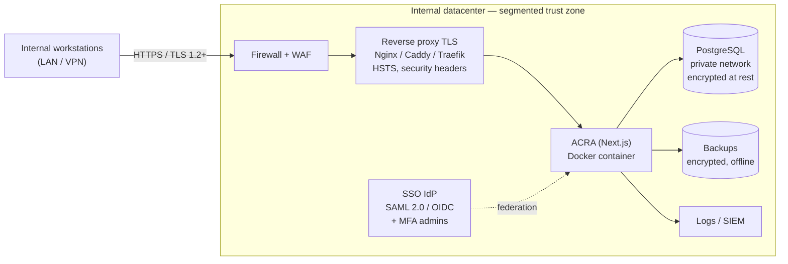
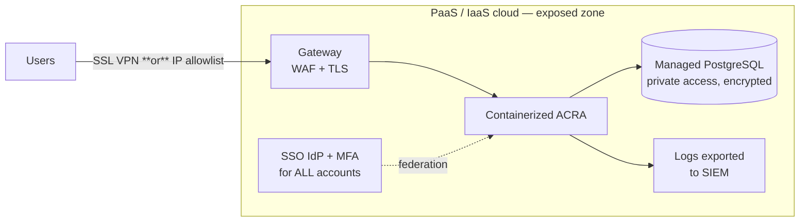

<div align="center">


# ACRA — Augmented Cyber (& Business) Risk Analysis

**The open-source platform for cyber and business risk management and GRC — EBIOS RM, ISO/IEC 27005, ISO 31000, NIST SP 800-30, 360 projects**

[](https://nextjs.org/)
[](https://www.typescriptlang.org/)
[](https://www.prisma.io/)
[](https://www.postgresql.org/)
[](https://www.docker.com/)
[](./LICENSE)
[](#-configurable-analysis-methods)
[](#️-grc-module--governance-risk--compliance)

**🌐 Langue / Language:** [🇫🇷 Français](README.md) · 🇬🇧 English · [🇩🇪 Deutsch](README.de.md) · [🇪🇸 Español](README.es.md) · [🇮🇹 Italiano](README.it.md)

</div>

---

## 🎯 Overview

**ACRA — Augmented Cyber (& Business) Risk Analysis —** is a self-hosted web platform for **cyber and business risk management (operational risk, projects, fraud, outsourcing) and GRC** — EBIOS RM analysis is just one of its methods. It lets a security team — even without deep expertise — run risk analyses with the method of its choice, then manage compliance, controls, incidents and action plans in one tool:

- **Multi-method risk analysis**: **EBIOS Risk Manager** (ANSSI, default), **ISO/IEC 27005:2022**, **ISO 31000:2018** and **NIST SP 800-30 Rev. 1**;
- **Full GRC, organised along the three lines of defense**: risk register, multi-framework compliance, **maturity** (CMMI target profiles), waivers, permanent control, internal audit, incidents (DORA), KRIs, GDPR register, unified action plan, steering and committee packs.

Each module can be enabled per organisation: a consultancy can stick to risk analysis, a bank can switch on the whole governance chain.

### The problem ACRA solves

A rigorous risk analysis is demanding (EBIOS RM has 5 interconnected workshops; ISO/IEC 27005 and NIST SP 800-30 each impose their own process), and it only matters if its conclusions are followed up: compliance, controls, waivers, actions. In practice this information lives in separate, hand-maintained spreadsheets.

ACRA links these pieces: a **methodological assistant** that guides you step by step with clickable examples and keeps the analysis consistent, connected to the organisation's **frameworks, controls and action plans**, with exports (PDF, Word, PowerPoint, Excel) ready for the committee or the auditor.

### Who is it for?

| Profile | Usage |
|---------|-------|
| 🔒 CISOs & Risk Managers | Drive analyses, approve, oversee the risk portfolio |
| 🔍 Security analysts | Run the workshops, document scenarios, plan measures |
| 🏢 IT & Management | Read summaries, track treatment, validate measure budgets |
| ✅ Compliance, permanent control, audit | Assess frameworks, steer maturity, test controls, follow up findings |
| 🗄️ DPO | Keep the record of processing activities (GDPR Art. 30), spot DPIAs |
| 🎓 Students & trainers | Learn EBIOS RM, ISO/IEC 27005 or NIST SP 800-30 on a concrete tool |

### What sets ACRA apart

- **Built-in methodological guidance**: every field has a tooltip, a link to the ANSSI guide, and contextual examples
- **Automatic consistency**: items from one workshop automatically feed the next
- **Several methods, one tool**: EBIOS RM, ISO/IEC 27005, ISO 31000 and NIST SP 800-30, chosen per instance or per analysis
- **Full GRC**: from risk analysis to the action plan, through compliance, maturity, waivers, controls, audit and incidents — modules enabled per organisation
- **15 control frameworks**: ISO 27001:2022, NIST CSF 2.0, NIST 800-53, CIS Controls v8, ANSSI Hygiene, HDS, PCI-DSS, DORA, IEC 62443, SOC 2, NIST SSDF, RGS, ReCyF, TISAX/VDA-ISA, NCSC CAF v4.0 — from a single interface
- **Sector-specific guidance & compliance**: business examples tailored to the sector and sub-sector, framework recommendations, regulatory status detection (NIS2, OIV…) — [see details](#-sector-specific-guidance--compliance)
- **Flash method (Club EBIOS)**: a guided single pass through the 5 workshops, leveraging capitalization (examples, security baseline) — ideal for a first analysis or a constrained context
- **Club EBIOS guides integrated**: the Flash method and method sheet 5 (stakeholder threat level) are implemented directly in the workflow
- **Maturity (CMMI target profiles)**: current and target level on any compliance framework (including NIST CSF 2.0 and NCSC CAF v4.0), gaps by domain, actions — [see details](#-maturity--cmmi-target-profiles)
- **Updates built into the application**: installed and available versions shown in Administration → Version, an “Update” button (stable / beta channels, automatic backup and health check), or `scripts/update.sh` on the command line — [see details](#updating)
- **100% self-hosted**: your data never leaves your infrastructure

---

## ✨ Features

### 🧭 Configurable analysis methods

The **analysis method** is configurable at **instance** level (SUPER_ADMIN) and **per analysis** — **EBIOS RM remains the default**.

- **5 methods**: **EBIOS RM** (ANSSI, 5 workshops) · **ISO/IEC 27005:2022** (phase-based process) · **NIST SP 800-30 Rev. 1** (Prepare / Conduct / Communicate / Maintain) · **ISO 31000:2018** (simple assessment) · **Project 360 analysis** (ISO 31000:2018: full operational risk of a project).
- **Direct-entry path** (ISO 31000 / 27005 / NIST): risks are entered directly (impact × likelihood) on the organisation's scale, without EBIOS scenarios; editable context, phase guidance, sector and cross-sector risk suggestions.
- **Three risk levels**: **gross** (inherent) → **current** (with existing measures) → **residual** (after the action plan); risk owner, measures and actions per risk, evaluation against the risk appetite.
- **Per-method report** in PDF and Excel.

### 📋 Complete EBIOS RM method

- **5 guided workshops** with a library of clickable examples (business values, risk sources, scenarios, measures…)
- **Flash method (Club EBIOS)**: a quick pass W1 → W2 → W3 → W4 → W5 in one go, capitalizing on examples and the security baseline, to quickly produce a risk list and an action plan
- **Interactive EBIOS RM guide** with direct links to the official ANSSI guide pages
- Visual **risk matrix** (severity × likelihood) with residual levels and before/after comparison
- **DICT** criteria (Availability, Integrity, Confidentiality, Traceability) on business values and supporting assets
- MITRE ATT&CK links on operational scenarios
- **Radar map of risk-source / target-objective pairs** (Workshop 2)
- **Logical AND/OR operators** in operating modes (Workshop 4)
- **Three likelihood assessment methods**: express, standard, advanced (per-elementary-action rating and overall likelihood computation)
- **EBIOS categorisation of measures**: governance, protection, defence, resilience
- **Protection marking** of the analysis document (unprotected → confidential), shown on the cover page and exports
- **x.y versioning** of analyses and **revision history** (operational/strategic cycle)
- **Ecosystem threat cartography** (Workshop 3, ANSSI method sheet 5): stakeholder dangerousness computed on 4 sub-criteria, polar radar with 3 zones, configurable scales, critical-third-party flagging — [see details](#️-ecosystem-threat-cartography-workshop-3)
- Cross-cutting **Third parties** view: organization-wide *third-party management*, aggregated across all analyses, filterable by zone and criticality

### 🔐 Security & frameworks

- Security measures from **15 frameworks**: ISO 27001:2022 · NIST CSF 2.0 · NIST 800-53 · CIS Controls v8 · ANSSI Hygiene · HDS · PCI-DSS · DORA · IEC 62443 · SOC 2 · NIST SSDF · RGS · ReCyF · TISAX/VDA-ISA · NCSC CAF v4.0 + custom controls — controls **localized in 5 languages**
- Configurable password policy (length, complexity, expiry, history, lockout)
- Configurable **MFA** (one-time passcode by **email** or **SMS**) with a 60-min confirmation window to avoid accidental lockout
- **Enterprise OIDC SSO** (Azure AD, Okta, Google Workspace…) wired into NextAuth — automatic (JIT) account provisioning and **IdP-driven RBAC**: map IdP **groups** (AD / SailPoint) to ACRA roles, re-synced on every sign-in. **SAML 2.0** built in maintenance mode. **SCIM 2.0** (provisioning/deprovisioning by the IdP)
- Full, exportable audit trail (CSV)

### 👥 Collaboration & governance

- **12-role RBAC** covering the **3 lines of defense**: SUPER_ADMIN · ADMIN · CISO · RISK_MANAGER · BUSINESS_MANAGEMENT · ANALYST · READER · **CONTROLLER** (permanent control) · **COMPLIANCE** · **DPO** (data protection) · **AUDITOR** (3rd line) · **OPERATIONAL** (1st line)
- **Multi-organisation**: organisation tree with hierarchical scopes (node / subtree); an ADMIN manages **only the accounts of their organisation**, a SUPER_ADMIN manages the instance
- Approval workflow: submission → review → approval (CISO or Risk Manager), with **separation of duties** — an approver cannot approve **their own** analysis (four-eyes principle) — and **self-validation** for single-user organisations (solo practices, where four-eyes is impossible)
- **Residual risk acceptance** by **Business management** (dedicated read-only role), distinct from analysis validation (deliverable acceptance)
- **Waivers** — *temporary* acceptance of a security-baseline non-conformity: attached to a framework control or a risk, **justified, compensated, time-boxed and monitored**. Per-organisation configurable workflow (**self-service** / **CISO** validation / CISO + **Business management**, optional group-CISO second review), **expiry alerts**, closure with **evidence**, and a cross-analysis **waiver register** — a compliance deliverable (ISO 27001, DORA exception register)
  - RSSI opinion **favourable, favourable with reservations** or unfavourable; the requester can **edit** the request before any opinion and **withdraw** it during review (kept for audit)
- Per-analysis access sharing with individual permissions
- Admin dashboard: user management (organisation scope), account creation, suspension, audit logs
- **Recovery (trash)**: an analysis deleted by a user remains restorable by an administrator for **30 days** before permanent purge

### 📈 Maturity — CMMI target profiles

Module enabled per organisation (off by default). Maturity is a **layer of compliance**: same framework, same control points, same actions — compliance says whether a control is met, maturity at which level the organisation stands and aims to be.

- **CMMI scale 0 to 5** (Incomplete → Optimizing), labels and definitions **editable by the ADMIN** in the configuration
- **Overall target level** (the “appetite statement”, RAS) and a specific target per item when needed
- **Dashboard** (RAD reading): average current and target maturity, gaps by domain, largest gaps, open and overdue actions, last review
- Any active framework can carry a profile: **NIST CSF 2.0**, **NCSC CAF v4.0**, ISO 27001, DORA, custom frameworks…
- A gap becomes an **action of the unified action plan**, shared with compliance (no duplicate); per-item history, CSV export

### 🧩 Project 360 analysis

Full operational risk of a project, **ISO 31000:2018** approach: a qualification questionnaire over **six domains** (cyber, IT — architecture and maintenance —, project, business, fraud, outsourcing) that proposes the risks to study; risks classified by domain; **import of risks from an existing cyber analysis** (EBIOS RM, ISO/IEC 27005, NIST SP 800-30); **dashboard by domain**; approval by the **RSSI and the Risk Manager** (two separate opinions). Projects are launched from the **Projects** tab (“Projects 360” module, on by default, set in Configuration → Features); the questionnaire is **pre-filled from existing data** (cyber analyses, ICT register, processes, GDPR register, DORA) and register risks are suggested, never creating duplicates. A project can also **be the starting point of a cyber analysis** (button in the Projects tab or selector at creation), and the **GRC cockpit** tracks progress, deadlines, CISO + Risk Manager sign-off and high risks across all projects.

### 🧭 Risk governance

- **Risk appetite (RAS / RAD)**: risk appetite statement (thresholds by category, target maturity) and dashboard (risks above appetite, maturity gaps, KRIs on alert) with status lights
- **Digital operational resilience testing (DORA, Articles 24 to 26)**: yearly programme, official test types, findings, critical or important functions, TLPT due date, and the **report on the review of the ICT risk management framework** (Article 6(5)) in Word
- **Risk mapping process**: the approach explained step by step, editable by governance, with the review status of the risk map

### 📊 Export & reporting

- Structured multi-page **PDF** export (executive summary, KPIs, workshops, measures, methodological appendices)
- **Excel (.xlsx)** export with all tabular data per sheet
- **JSON** export (full, re-importable backup) and **CSV** (tabular data)
- Analysis import from JSON or CSV
- **Committee packs** (PDF) with an **"overall risk level" banner** (traffic-light HIGH / MODERATE / UNDER CONTROL) plus a gravity × likelihood **risk heatmap** — the message of a board file at a glance

### 🗄️ Data protection (DPO / GDPR)

- **Record of Processing Activities (RoPA — GDPR Art. 30)**: per-organisation register reserved for the **DPO**, with **completeness checks** (purpose, categories of persons/data, recipients, retention period, security measures, non-EU transfer safeguards)
- **DPIA decision support (Art. 35)**: automatic detection of processing needing an impact assessment (special-category data Art. 9, large-scale systematic monitoring)

### 🔌 Interoperability & API

- **Public v1 API** (REST, key-based Bearer auth): read the **risk register**, **controls** and **incidents**; built-in **OpenAPI** spec
- **Bulk import** via API (risk register, controls), with per-row error reporting
- **Signed outbound webhooks** (HMAC): notify a third-party system (SOAR/SIEM/ITSM) on events (risk created, incident declared…), with retries and an anti-SSRF guard
- **OIDC SSO + SCIM** (see *Security*) to plug authentication and provisioning into the corporate directory

### 🌐 UX & accessibility

- Interface in **5 languages**: Français · English · Deutsch · Español · Italiano
- **Auto-save** on every change (no data loss)
- **Autocomplete** on repetitive fields (organisation, risk sources, stakeholders, measures, business values, supporting assets, entity) from values already entered in scope — harmonises labels and cuts re-typing
- **Smart defaults**: organisation pre-filled on a new analysis; **action due dates computed from priority** (Critical / Major / Moderate), per-organisation configurable delays; baseline frameworks **pre-ticked by sector**
- Dashboard with KPIs, charts, critical-risk alerts, global search
- Light / dark / automatic theme
- RGAA-compliant: keyboard navigation, ARIA, accessible contrasts

---

## 🎬 Demo


## 📸 Interface preview

| | Light theme | Dark theme |
|---|---|---|
| **Dashboard** |  |  |
| **My analyses** |  |  |
| **Workshop 1 — Scope & baseline** |  |  |
| **Workshop 5 — Risk treatment** |  |  |
| **Risk mapping** |  |  |
| **Workshop 3 — Ecosystem cartography** |  |  |
| **Configuration (scales & matrix)** |  |  |
| **Administration** |  |  |
| **Audit log** |  |  |

---

## 🏛️ GRC module — Governance, Risk & Compliance

Beyond risk analysis (EBIOS RM, ISO/IEC 27005, ISO 31000, NIST SP 800-30), ACRA ships a **complete GRC foundation** structured around the **three lines of defense** model, designed for regulated entities (banking, insurance, healthcare) and aligned with **DORA**, **NIS2** and **ISO/IEC 27001/27002**. Each module is enabled per organisation; the navigation automatically switches to "GRC mode" as soon as a 2nd/3rd-line module is active.

> The screenshots below come from the **realistic demo dataset** (banking sector), anchored on public threats (ENISA Threat Landscape). Loadable then purgeable: `npm run db:seed:demo` / `npm run db:seed:demo:purge`.

### 📊 GRC steering — consolidated cockpit

Executive view aggregating, per organisation subtree, the **risk posture** and action-plan progress: register (high/medium/low), net losses (LDC), open incidents, compliance rate, control anomalies, critical findings, appetite, KRIs and **major DORA ICT** incidents. One-click generation of **committee packs** and the **internal control report** (PDF/PPTX).

 

### 📚 Frameworks & requirements — *proven* compliance

The **shipped frameworks** (ISO 27001, NIST CSF/800-53, CIS, ANSSI, HDS, PCI-DSS, DORA, IEC 62443, SOC 2, RGS, ReCyF…) and your **own frameworks** (ISSP, internal policies) broken down into **controllable, auditable control points**. A **default security policy** (DORA + ISO 27001/27002 baseline, with its missions) initialises in one click. Each requirement's **coverage** is **derived from real controls** and audit findings — compliance is *proven*, not merely declared.

 

A framework's **derived coverage**: each requirement's status (compliant / partial / anomaly / not covered) is computed from the **real controls** that cover it and from audit findings — here StarBank's ISSP covered by permanent controls.

 

### 🚨 Incidents & losses — DORA reporting (Art. 19)

1st-line declaration, 2nd-line qualification, losses in **LDC** logic (gross, recoveries, net). Each incident is **automatically classified under DORA** (minor / significant / major); for major incidents the **Art. 19 notification deadlines** (initial / intermediate / final) are computed and tracked, and the **ITS register** is exportable.

 

### ✅ Permanent control (L1/L2) & 🔎 Internal audit (3rd line)

A library of **permanent controls** attached to the mesh (risk / process / framework requirement), run periodically, with **observed effectiveness** (RCSA loop) and **L1 control campaigns**. On the 3rd line, **internal audit** plans missions, issues **findings** (criticality + recommendation) and tracks their resolution; **regulator** recommendations (ACPR/ECB) are tracked in the same flow.

 

### 🛡️ Compliance & 🗂️ Document library

Tracking of **compliance** per framework (multi-organisation heatmap, **SoA** CSV/PDF export) and a GRC **document library** (ISSP, strategies, policies): versioned upload, linked to a framework / risk / organisation, authenticated download.

 

### 📄 Ready-to-use regulatory outputs

- **RAS** — Risk Appetite Statement (PDF)
- **SoA** — Statement of Applicability (PDF)
- **Committee packs** — Risk / Compliance / Incidents (PDF)
- **Annual internal control report** — 3 lines of defense + DORA resilience section (PDF **and PPTX**)
- **DORA ITS register** of major incidents (Art. 19) and **ICT third-party information register** (Art. 28) — CSV
- **Risk map** (PDF)

Example — **annual internal control report** (generated from the StarBank demo data): overall assessment, points of attention, then summary by line of defense (permanent control, risk management & compliance, audit) and DORA resilience section.


---

## 🚀 Quick Start (Docker)

**No local install of Node, npm or Prisma is required**: the Docker image bundles all
dependencies and the Prisma client, and applies migrations automatically on startup
(the `migrator` service).

```bash
git clone https://github.com/bdudout/acra.git
cd acra
make setup        # generates .env + random secrets (interactive)
docker compose up -d
```

> No `make`? Use directly: `./scripts/setup.sh` (or `npm run setup`).
> Automated / CI install (no questions asked): `./scripts/setup.sh --auto`.

`setup.sh` generates strong secrets for you (`NEXTAUTH_SECRET`, PostgreSQL password,
`SECRETS_ENCRYPTION_KEY`) and **only regenerates missing values** if re-run (details in
the "Detailed installation" section below).

**The application is available at http://localhost:3000.**
Create your account at `/auth/register` — **the first account created automatically
becomes an ADMINISTRATOR**.

To load demonstration data (optional, never in production):

```bash
docker compose exec app npx prisma db seed
# Demo account created: admin@chu-metropole.fr / Acra@Admin2024!
# ⚠️ Testing only — change/delete this account before any production deployment
```

---

## 📦 Detailed installation

### Prerequisites

| Tool | Minimum version | Notes |
|------|-----------------|-------|
| Docker Desktop | 4.x | or Docker Engine + Compose v2 |
| Available RAM | 512 MB | 1 GB recommended |
| Free ports | 3000, 5432 | configurable in `docker-compose.yml` |

> **Without Docker** (local development): Node.js 20+ and PostgreSQL 14+ required — see [Local development](#-local-development).

---

### Step 1 — Clone the repository

```bash
git clone https://github.com/bdudout/acra.git
cd acra
```

---

### Step 2 — Configure the environment (automated)

The setup script creates the `.env` file and **generates strong secrets**. It is
**idempotent**: re-run, it keeps already-defined values and only fills in what's missing.

```bash
./scripts/setup.sh          # interactive (asks for the public URL)
# or, with no interaction at all (random secrets, default URL):
./scripts/setup.sh --auto
```

The script fills in automatically:

| Variable | Role | Generated by setup.sh |
|----------|------|:---:|
| `NEXTAUTH_SECRET` | JWT session signing | ✅ random (48 B) |
| `POSTGRES_PASSWORD` | PostgreSQL password | ✅ random (32 chars) |
| `SECRETS_ENCRYPTION_KEY` | AES-256-GCM encryption of secrets in DB (OIDC, SMS, SMTP) | ✅ random (48 B) |
| `DATABASE_URL` | Prisma connection | ✅ derived from PostgreSQL variables |
| `POSTGRES_USER` / `POSTGRES_DB` | Database identity | `acra_user` / `acra_rm` |
| `NEXTAUTH_URL` | Public URL | asked (default `http://localhost:3000`) |

> **Manual configuration** (alternative): `cp .env.example .env` then replace all
> `CHANGEZ_MOI` values. Generate a secret with `openssl rand -base64 48`.
>
> ⚠️ **Production**: `NEXTAUTH_URL` must be **HTTPS**. Never commit `.env`
> (already in `.gitignore`). If `SECRETS_ENCRYPTION_KEY` changes, secrets already
> encrypted in the database will need to be re-entered in the admin interface.

---

### Step 3 — Start the services

```bash
docker compose up -d
```

Docker starts 4 services:
- **`db`** — PostgreSQL 16 (port 5432)
- **`migrator`** — runs `prisma migrate deploy` on startup (then exits)
- **`app`** — Next.js application (port 3000)
- **`backup`** — automatic PostgreSQL backups (7-day rotation)

Check that everything is up:

```bash
docker compose ps
# All services should be "running" (except migrator: "exited 0")

curl http://localhost:3000/api/health
# {"status":"ok","db":"connected","timestamp":"..."}
```

---

### Useful commands

```bash
# View logs in real time
docker compose logs -f app

# Stop the services
docker compose down

# Stop AND remove volumes (erases the database)
docker compose down -v

# Rebuild after code changes
docker compose up -d --build

# Access the database via psql (uses the container credentials)
docker compose exec db sh -c 'psql -U "$POSTGRES_USER" "$POSTGRES_DB"'

# Run a demo data seed
docker compose exec app npx prisma db seed

# Run migrations manually
docker compose exec app npx prisma migrate deploy
```

---

### Updating

Two channels:
- **stable** — latest validated version (`stable` branch, aligned with the latest published release);
- **beta** — latest validated version + later changes (`main` branch, version `x.y.z-beta.n`).

```bash
scripts/update.sh stable   # or: scripts/update.sh beta
```

The script refuses to run with local changes, backs up the database (`backups/`),
fast-forwards the code only, rebuilds, applies migrations and checks health; on failure
it prints the rollback command.
Manual equivalent: `git checkout stable && git pull && docker compose up -d --build`.

**“Update” button** (Administration → Version): a single command on the server, run
as the user who manages Docker:

```bash
scripts/update-agent.sh --install     # adds the cron job; in production: --install -f docker-compose.yml -f docker-compose.production.yml
```

The application runs no command itself: it drops a request that the agent executes
(backup, update, rebuild, health check). Uninstall: `scripts/update-agent.sh --uninstall`.

**Instance older than v1.0.3** (without these scripts): update manually once, then the
button and `scripts/update.sh` take over:

```bash
git fetch origin && git checkout stable && git pull   # or stay on main for beta
scripts/update-agent.sh --install                      # optional: enables the button
docker compose up -d --build
```

---

### Backup and restore

PostgreSQL backups are automated in `docker-compose.yml` (7-day rotation):

```bash
# Manual backup
docker compose exec db sh -c 'pg_dump -U "$POSTGRES_USER" "$POSTGRES_DB"' > backup_$(date +%Y%m%d).sql

# Restore
docker compose exec -T db sh -c 'psql -U "$POSTGRES_USER" "$POSTGRES_DB"' < backup_20240115.sql
```

---

## 🔧 Local development

To contribute to or customize ACRA without Docker:

### Prerequisites

- **Node.js** 20+ (`node --version`)
- **PostgreSQL** 14+ (or Docker for the DB only)
- **npm** 10+

### Installation

```bash
# 1. Clone the repository
git clone https://github.com/bdudout/acra.git
cd acra

# 2. Install dependencies (also generates the Prisma client via postinstall)
npm install

# 3. Start PostgreSQL via Docker (simplest option)
docker run -d --name acra-db \
  -e POSTGRES_USER=acra_user \
  -e POSTGRES_PASSWORD=acra_secret \
  -e POSTGRES_DB=acra_rm \
  -p 5432:5432 postgres:16-alpine

# 4. Configure the environment (generates .env with secrets)
./scripts/setup.sh --auto
# Locally without Docker for the app, point the DB at localhost:
sed -i 's/@db:5432/@localhost:5432/' .env

# 5. Apply migrations and generate the Prisma client
npx prisma migrate deploy
npx prisma generate

# 6. (Optional) Load demo data
npx prisma db seed

# 7. Start in development mode (hot reload)
npm run dev
```

The application is available at **http://localhost:3000**

### Available scripts

```bash
npm run dev          # Development server (hot reload)
npm run build        # Production build
npm run start        # Production server (after build)
npm run setup        # (Re)generates the .env file (missing secrets)
npm test             # Vitest unit tests (run once)
npm run test:watch   # Tests in watch mode
npm run test:coverage # Coverage report
npx tsc --noEmit     # TypeScript check without compilation
```

### TDD workflow

> **TDD is mandatory**: every new feature must come with a test written *before* the implementation. See [CONTRIBUTING.md](./CONTRIBUTING.md).

```bash
# 1. Write the test (it must fail)
# → src/__tests__/unit/lib/my-feature.test.ts

# 2. Run in watch mode to see the red
npm run test:watch

# 3. Implement until green
# 4. Refactor
```

---

## 🏗️ Architecture

```
ebios-rm/
├── src/
│   ├── app/                          # Next.js pages (App Router)
│   │   ├── page.tsx                  # Landing page
│   │   ├── dashboard/                # KPI dashboard
│   │   ├── analyses/                 # List, creation, detail
│   │   │   └── [id]/atelier/[num]/  # The 5 EBIOS RM workshops
│   │   ├── risques/                  # Global risk view
│   │   ├── actions/                  # Global action plan (filters)
│   │   ├── auth/                     # Login / Register / Reset
│   │   ├── admin/                    # Administration (ADMIN only)
│   │   │   ├── users/                # User management
│   │   │   ├── security/             # MFA, SSO, password policy
│   │   │   ├── audit/                # Audit log
│   │   │   └── config/               # Organization configuration
│   │   ├── configuration/            # Scales, matrix, frameworks
│   │   └── profile/                  # Profile, language, theme
│   │   └── api/                      # REST API routes (Next.js)
│   ├── components/
│   │   ├── workshops/                # Atelier1.tsx → Atelier5.tsx
│   │   ├── Navbar.tsx                # Main navigation + search
│   │   ├── RiskMatrix.tsx            # Interactive risk matrix
│   │   ├── WorkshopProgress.tsx      # Workshop progress bar
│   │   ├── EbiosGuide.tsx            # Interactive EBIOS RM guide
│   │   ├── FrameworkControlsPanel.tsx # Multi-framework measures panel
│   │   └── AnalysesChart.tsx         # Dashboard charts
│   └── lib/
│       ├── ebios-data.ts             # EBIOS RM library (suggestions)
│       ├── frameworks-data.ts        # ISO 27001, NIST, CIS controls…
│       ├── permissions.ts            # Centralized RBAC matrix
│       ├── logger.ts                 # Structured Winston logs + audit trail
│       ├── useAutoSave.ts            # React auto-save hook
│       ├── password-policy.ts        # Password policy validation
│       ├── prisma.ts                 # Prisma singleton client
│       └── i18n/                     # Translations (fr/en/de/es/it)
├── prisma/
│   ├── schema.prisma                 # PostgreSQL data model
│   └── migrations/                   # Versioned SQL migrations
├── src/__tests__/                    # Vitest unit tests
├── docker-compose.yml
├── Dockerfile
└── .env.example
```

### Tech stack

| Layer | Technology | Version |
|-------|------------|---------|
| Framework | Next.js App Router (Server + Client Components) | 16 |
| Language | TypeScript strict | 5 |
| Database | PostgreSQL | 16 |
| ORM | Prisma | 5 |
| Authentication | NextAuth.js (credentials + JWT) | 4 |
| UI | Tailwind CSS | 3 |
| PDF export | @react-pdf/renderer (server-side) | — |
| Excel export | ExcelJS | — |
| Tests | Vitest + Testing Library | — |
| Logs | Winston (structured JSON) | — |
| Deployment | Docker + Docker Compose | — |

---

## 🔒 Security

### Measures in place

- Passwords hashed with **bcrypt** (cost 12)
- Signed **JWT** sessions (`NEXTAUTH_SECRET`)
- Next.js authentication middleware on all protected routes
- **Security HTTP headers**: X-Frame-Options, CSP, X-Content-Type-Options, Referrer-Policy, HSTS
- Server-side input validation: **Zod** schemas (authentication, admin policies) and **allowlist sanitizers** on workshops and imports (anti mass-assignment, CWE-915)
- Per-user data isolation + per-analysis RBAC
- **Full audit trail** (`AuditLog` table) for all sensitive actions, exportable to CSV
- Rate limiting on authentication routes
- Configurable **MFA** with a safety window (auto-disabled if not confirmed within 60 min)
- Configurable **SSO** SAML 2.0 / OIDC

### Production checklist

```bash
# 1. Generate all secrets (NEXTAUTH_SECRET, PostgreSQL password,
#    SECRETS_ENCRYPTION_KEY) in one command — idempotent:
./scripts/setup.sh --auto

# 2. Set the public HTTPS URL in .env
#    NEXTAUTH_URL=https://acra.mydomain.com   (HTTPS required)

# 3. Put it behind an HTTPS reverse proxy (Nginx, Caddy, Traefik + TLS)

# 4. Do NOT load the demo seed in production. If it was loaded by mistake:
#    log in at /admin/users and delete/reset admin@chu-metropole.fr

# 5. Start and check the health check
docker compose up -d
curl https://your-domain.com/api/health
# {"status":"ok","db":"connected",...}
```

> The **first account** created at `/auth/register` becomes the instance **SUPER-ADMINISTRATOR**.
> Create it immediately after deployment so a third party cannot claim that role
> (registration is open by default).

> A full OWASP/WSTG security audit was conducted on the application. See the report in [docs/](./docs/).

---

## 📖 The 5 EBIOS RM workshops

| # | Workshop | Description |
|---|----------|-------------|
| **W1** | Scope & security baseline | Scope, missions, business values (DICT criteria), supporting assets, feared events, security frameworks |
| **W2** | Risk sources | Identify attackers, targeted objectives (RS/TO couples), P1/P2 relevance levels |
| **W3** | Strategic scenarios | Ecosystem, **stakeholder threat cartography** (dangerousness radar), attack paths, ecosystem security measures |
| **W4** | Operational scenarios | Attackers' technical actions, likelihood, MITRE ATT&CK links |
| **W5** | Risk treatment | Treatment strategies (reduce, transfer, refuse, accept), per-framework measures, residual risks, action plan |

> **⚡ Flash method (Club EBIOS)**: a fast pass W1 → W2 → W3 → W4 → W5, available from the dashboard. Following the Club EBIOS "Flash" approach, all workshops are run in a single pass by capitalizing on examples and the security baseline, focusing on the most relevant scenarios (≈ 5 max). The scale and matrix remain those configured by the administrator. Ideal for a first analysis or a constrained context.

---

## 🗺️ Ecosystem threat cartography (Workshop 3)

ACRA implements **ANSSI / Club EBIOS method sheet 5** ("estimating the dangerousness of stakeholders") to prioritize ecosystem third parties: suppliers, service providers, clients, partners, regulators.

A third party's threat level is computed from **4 sub-criteria** rated on configurable qualitative scales:

```text
              Dependency × Penetration              (exposure, ↑ threat)
threat  =  ───────────────────────────────────
              Cyber maturity × Trust                 (reliability, ↓ threat)
```

Third parties are placed on a **polar radar**: the closer to the centre, the higher the threat. Three **equal-width** zones — danger / control / watch — drive prioritization (third parties in danger or control are *critical* and feed the strategic scenarios).

| Threat radar | Calculation diagram (built-in help) |
|---|---|
|  |  |

**Reading the radar:**

- **Colour** of a point = cyber reliability (red low → green high)
- **Size** of a point = exposure (bigger = more exposed)
- **Rings** = threat zones (danger orange · control yellow · watch green)
- **★** = third party manually flagged *critical*
- **Label** = editable short name (click or **double-click** the point) or ref `T1, T2…`
- Hovering a point → details of the 4 sub-criteria, exposure/reliability and threat

**Rank 2 / 3 tiers (ecosystem depth)** — following Club EBIOS method sheet 5, a critical tier can be broken down into **connected stakeholders** (e.g. a provider's host, a partner's subcontractor). ACRA handles three depth ranks: from a critical tier, the **"+ connected stakeholder"** button adds a **rank-2** stakeholder, itself divisible into **rank 3**. On the radar, a **"Ranks 2/3"** checkbox reveals these connected tiers (hidden by default), dimmed and **linked to their parent tier by a dashed line**, with automatic avoidance of point/label overlaps. The executive summary (PDF) stays focused on rank-1 tiers for readability.

**Configurable scales** — each level of the 4 criteria (1→4 by default) can be renamed in `Configuration → Ecosystem`, with levels added/removed (ADMIN only). The radar adapts automatically to the scale.


**Cross-cutting Third parties view** — the **Third parties** page aggregates stakeholders from **all** analyses, filterable by zone and criticality (★), for organization-wide *third-party management*. A same third party may appear several times (its dangerousness depends on the analysed scope).


The radar, criticality stars and the stakeholder table (4 sub-criteria + *Critical* column) are also present in the **PDF export**.

---

## 🏛️ Recommended secure architecture (ANSSI best practices)

ACRA handles sensitive data (risk analyses, ecosystem cartography). Deployment should follow the **ANSSI IT hygiene guide** principles: segmentation, defence in depth, least privilege, strong authentication, logging.

### Case 1 — Internal *on-premises* hosting (recommended)

Host **in your datacenter**, behind a firewall, with no direct Internet exposure. Preferred scenario for the most sensitive data.



**Key measures:**
- **Segmented** network (dedicated VLAN), application **not exposed** to the Internet; access via LAN or **VPN**.
- **Firewall** + WAF upstream; reverse proxy terminating HTTPS in **TLS 1.2+** (`NEXTAUTH_URL=https://…`), **HSTS** enabled.
- **SSO** (SAML/OIDC) + **mandatory MFA for administrators** (email/SMS OTP).
- PostgreSQL **never publicly exposed**, **encrypted at rest**, access restricted to the app.
- **Encrypted backups**, regular and tested; secrets via a vault (`SECRETS_ENCRYPTION_KEY`).
- Centralized **logging** (ACRA audit trail + Winston logs → SIEM); periodic access reviews.

### Case 2 — External *PaaS / IaaS* hosting (cloud)

If hosting on an external cloud (IaaS/PaaS), **reduce the attack surface** and strengthen authentication for **all** accounts.



**Key measures (in addition to case 1):**
- Restricted access via **IP allowlist** **or** **SSL VPN** — no open public access.
- **SSO + MFA for ALL users** (not just admins).
- **Managed database on a private network** (never a public IP), encryption in transit and at rest.
- Secrets in a **managed vault** (KMS / Secrets Manager); regular rotation.
- Logs exported to a **SIEM**; alerting on sensitive events (logins, exports, deletions).

### What ACRA provides to apply these best practices

| ANSSI best practice | ACRA feature |
|---|---|
| Strong authentication | **MFA** email/SMS OTP, `ALL` or `ADMIN_ONLY` scope |
| Federated identity | **SSO** SAML 2.0 / OIDC with auto-provisioning |
| Least privilege | **RBAC** 5 roles + per-analysis sharing |
| Traceability | Full **audit trail**, CSV-exportable |
| Confidentiality in transit | Enforced HTTPS + **security headers** (CSP, HSTS, X-Frame-Options…) |
| Secret protection | Encrypted secrets (`SECRETS_ENCRYPTION_KEY`), bcrypt (cost 12) |
| Reversibility / error tolerance | **30-day trash** (soft delete + admin recovery) |
| Input robustness | Zod + **allowlist sanitizers** (anti mass-assignment) |

---

## 🧭 Sector-specific guidance & compliance

ACRA adapts the approach to the organization's **regulatory and sector context**, without ever imposing it.

**Sector-tailored examples** — the sector chosen during scoping (and, for regulated sectors, a **sub-sector**) feeds targeted business-example libraries in Workshops 1 to 3 (business values, supporting assets, feared events, risk sources, scenarios, stakeholders). **16 families** cover the 20 sectors: healthcare, banking/finance, industry & energy (including **renewables**: wind/PV/BESS), transport, telecom, public administration, food industry, real estate/construction, media, tourism, non-profits, legal, digital, education/research, retail, defense. **Sub-sectors** refine the content further: a notary does not see examples specific to lawyers, rail differs from air, construction from a real-estate agency.

**Framework recommendation** — the sector, the **organization size** (very small / SME / large) and the sub-sector steer the recommended frameworks (e.g. Banking → DORA, Healthcare → HDS, Industry/Energy → IEC 62443, Public administration → RGS, software vendor → NIST SSDF/SOC 2). DORA is only suggested to regulated financial entities (not a pre-authorization fintech startup).

**Compliance module (optional, enabled per organization)**

- **Qualification** of the analysis (criticality, personal data, exposure, in-house CISO…) producing orientations;
- **Regulatory status**: proactive detection of the **NIS2** regime (*essential* / *important* entity by sector), **OSE / EEI / OIV** markers with **OIV sector** selection (12 SAIV sectors), flagging of the **OIV (LPM) + EEI (NIS2) dual regime** and that **DORA prevails over NIS2** for finance;
- **contextual obligations** (registration, incident notification to the CSIRT/ANSSI — or to **CERT Santé/ANS** for healthcare, SIIV crisis exercise…);
- **information classification** (**IGI-1300** marker: NP / DR / Secret / Top Secret);
- **GDPR Art. 9 alert** when sensitive data is present;
- report **value notes**: ICT risk documentation (**DORA Art. 8**), part of a **security accreditation** file (PSSIE / RGS / IGI 1300), **ORSA** assessment (Solvency II) for insurance;
- **NIS2 Art. 21** coverage of the chosen measures framework.

**Generative AI** — emerging risks related to generative AI (deepfakes, AI-assisted phishing, data leaks via "Shadow AI", prompt injection) are included in the default examples, across all sectors.

> These elements are **documentary and non-blocking**: they guide and alert, but the analyst remains free to choose.

---

## 🏢 Multi-organization (hierarchical)

ACRA manages **several organizations in a single instance**, arranged as a **tree**. One install covers four use cases:

| Use case | Mechanism |
|---|---|
| **Consulting firm** serving several clients | **Isolated root** organizations; a consultant is a **member of several** orgs with a role in each |
| **Large group** (entity + group) | **Hierarchy**; the entity CISO has an *entity* view, the group CISO a **consolidated** sub-tree view |
| **Multi-site / multi-country company** | Hierarchy company → sites |
| **Subsidiaries and sub-subsidiaries** | Tree of **any depth** |

Each member has a role **per organization** and a scope `NODE` (this org) or `SUBTREE` (org + descendants, for consolidated view). Isolation is centralized: every view filters analyses by the **active** organization (org switcher in the header). When a scope spans several orgs, the dashboard/risks/tiers show each item's **source entity**.

**Per-organization configuration** — each org may have its own ecosystem scales, examples, frameworks and options; an org without a value **inherits** from its ancestors, then defaults. **Risk scales** are an instance setting editable by the super-admin: **shared** (group mode) or **per organization** (consultant mode).

**Roles** — an instance role **`SUPER_ADMIN`** manages organizations and crosses all scopes; `ADMIN` becomes an organization admin. The first account of a fresh install is SUPER_ADMIN; on an existing instance the oldest admin is promoted automatically on first boot. Each organization gets an **auto-generated logo** (deterministic gradient + monogram).

Administration: `Admin → Organizations` (super-admin only).

---

## 🌐 Internationalization

The interface is available in **5 languages**, selectable at any time in the profile:

| Code | Language | Completeness |
|------|----------|-------------|
| `fr` | Français | ✅ 100% (reference) |
| `en` | English | ✅ 100% |
| `de` | Deutsch | ✅ 100% |
| `es` | Español | ✅ 100% |
| `it` | Italiano | ✅ 100% |

To add a language, copy `src/lib/i18n/fr.ts`, translate all keys and save the file with the matching ISO 639-1 code. TypeScript automatically checks that all keys are present.

---

## 👥 User roles (RBAC)

| Role | Create analysis | Edit | Approve | Admin |
|------|:---:|:---:|:---:|:---:|
| `ADMIN` | ✅ | ✅ all | ✅ | ✅ |
| `RSSI` (CISO) | ✅ | ✅ own + shared | ✅ | ❌ |
| `RISK_MANAGER` | ✅ | ✅ own + shared | ✅ | ❌ |
| `DIRECTION_METIER` (Business mgmt) | ❌ | ❌ (read) | ❌ | ❌ — *accepts residual risks* |
| `ANALYSTE` (Analyst) | ✅ | ✅ own + shared | ❌ | ❌ |
| `LECTEUR` (Reader) | ❌ | ❌ | ❌ | ❌ |

**GRC roles / 3 lines of defense** (global read of the framework + write on their module):

| Role | Scope |
|------|-------|
| `CONTROLEUR` | Permanent control (1st/2nd line) — running & defining controls |
| `CONFORMITE` | 2nd line — compliance, waivers, RCSA campaigns |
| `DPO` | Data protection — **Record of Processing Activities (RoPA, GDPR Art. 30)** |
| `AUDITEUR` | 3rd line — internal audit (missions, findings, recommendations) |
| `METIER` | 1st-line operational — incident reporting, control execution |

Access can also be granted **analysis by analysis** (ad-hoc sharing with any user).

---

## 🛠️ Troubleshooting

### The application won't start

```bash
# Check container status
docker compose ps

# View detailed logs
docker compose logs app
docker compose logs migrator

# Check that ports are free
lsof -i :3000
lsof -i :5432
```

### Prisma migration error

```bash
# Force migration resolution
docker compose exec app npx prisma migrate resolve --applied "migration_name"
docker compose exec app npx prisma migrate deploy
```

### Database connection issue

```bash
# Check connectivity
docker compose exec app npx prisma db execute --stdin <<< "SELECT 1;"

# Check the DATABASE_URL variable in .env
docker compose exec app env | grep DATABASE
```

### Fully reset the application

```bash
# ⚠️ Erases all data
docker compose down -v
docker compose up -d
```

---

## 🤝 Contributing

See [CONTRIBUTING.md](./CONTRIBUTING.md) for the full guide.

**TL;DR:**
1. Fork the repo and create a `feature/my-feature` branch
2. Write the tests first (**TDD mandatory** — see CLAUDE.md)
3. Implement and make sure `npm test` is green
4. Add translations to the **5 i18n files** if UI strings are added
5. Run `npx tsc --noEmit` — zero TypeScript errors
6. Open a Pull Request with a clear description

---

## 📄 License

MIT — see [LICENSE](./LICENSE)

The EBIOS RM methodology is developed and maintained by [ANSSI](https://cyber.gouv.fr/la-methode-ebios-risk-manager). This application is not affiliated with ANSSI.
