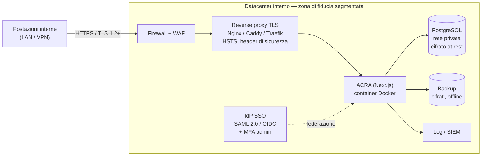
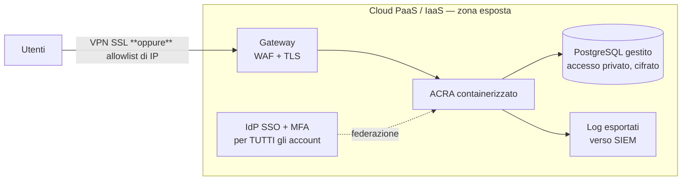

<div align="center">


# ACRA — Augmented Cyber Risk Analysis

**La piattaforma open-source che rende l'analisi dei rischi EBIOS RM accessibile a tutti**

[](https://nextjs.org/)
[](https://www.typescriptlang.org/)
[](https://www.prisma.io/)
[](https://www.postgresql.org/)
[](https://www.docker.com/)
[](./LICENSE)
[](https://cyber.gouv.fr/la-methode-ebios-risk-manager)
[](https://www.iso.org/standard/75281.html)

**🌐 Langue / Language:** [🇫🇷 Français](README.md) · [🇬🇧 English](README.en.md) · [🇩🇪 Deutsch](README.de.md) · [🇪🇸 Español](README.es.md) · 🇮🇹 Italiano

</div>

---

## 🎯 Panoramica

**ACRA (Augmented Cyber Risk Analysis)** è un'applicazione web guidata che consente a qualsiasi team di sicurezza — anche senza competenze approfondite — di condurre un'analisi dei rischi completa secondo il metodo **EBIOS Risk Manager** dell'ANSSI francese, compatibile con **ISO 27005**.

### Il problema che ACRA risolve

Le analisi dei rischi EBIOS RM sono impegnative: il metodo prevede 5 workshop interconnessi, decine di concetti da padroneggiare, e il minimo errore di coerenza può invalidare l'intero studio. In pratica, i team ricorrono a fogli Excel complessi, a costosi consulenti, o rinunciano al rigore metodologico.

ACRA cambia tutto questo: è un **assistente metodologico interattivo** che guida passo dopo passo, propone esempi cliccabili a ogni fase, mantiene la coerenza tra i workshop e produce automaticamente un report PDF strutturato.

### Per chi?

| Profilo | Utilizzo |
|---------|----------|
| 🔒 CISO e Risk Manager | Guidare le analisi, approvare, supervisionare il portafoglio rischi |
| 🔍 Analisti di sicurezza | Condurre i workshop, documentare gli scenari, pianificare le misure |
| 🏢 IT e Direzione | Leggere le sintesi, seguire il trattamento, validare i budget delle misure |
| 🎓 Studenti e formatori | Imparare il metodo EBIOS RM con uno strumento concreto |

### Cosa distingue ACRA

- **Guida metodologica integrata**: ogni campo dispone di un tooltip, un link alla guida ANSSI ed esempi contestuali
- **Coerenza automatica**: gli elementi di un workshop alimentano automaticamente i successivi
- **7 framework di misure**: ISO 27001:2022, NIST CSF, NIST 800-53, CIS Controls v8, Igiene ANSSI, HDS, PCI-DSS — da un'unica interfaccia
- **Modalità Express**: un'analisi completa (W1+W2+W5) in meno di 30 minuti per contesti urgenti
- **100% self-hosted**: i tuoi dati non lasciano mai la tua infrastruttura

---

## ✨ Funzionalità

### 📋 Metodo EBIOS RM completo

- **5 workshop guidati** con libreria di esempi cliccabili (valori di business, fonti di rischio, scenari, misure…)
- **Modalità analisi Express** (W1 + W2 + W5) per ottenere rapidamente un elenco di rischi e un piano d'azione
- **Guida EBIOS RM interattiva** integrata con link diretti alle pagine della guida ufficiale ANSSI
- **Matrice dei rischi** visiva (gravità × probabilità) con livelli residui e confronto prima/dopo le misure
- Criteri **DICT** (Disponibilità, Integrità, Riservatezza, Tracciabilità) su valori di business e beni di supporto
- Link MITRE ATT&CK sugli scenari operativi
- **Mappa di minaccia dell'ecosistema** (Workshop 3, scheda metodo 5 ANSSI): pericolosità delle parti interessate calcolata su 4 sotto-criteri, radar polare a 3 zone, scale configurabili, marcatura dei terzi critici — [vedi dettaglio](#️-mappa-di-minaccia-dellecosistema-workshop-3)
- Vista trasversale **Terzi**: gestione dei terzi (*third-party management*) a livello di organizzazione, aggregata su tutte le analisi, filtrabile per zona e criticità

### 🔐 Sicurezza e framework

- Misure di sicurezza da **7 framework**: ISO 27001:2022 · NIST CSF · NIST 800-53 · CIS Controls v8 · Igiene ANSSI · HDS · PCI-DSS + controlli personalizzati
- Politica delle password configurabile (lunghezza, complessità, scadenza, cronologia, blocco)
- **MFA** configurabile (codice monouso via **e-mail** o **SMS**) con finestra di conferma di 60 min per evitare blocchi accidentali
- **SSO** configurabile (SAML 2.0 o OIDC) — provisioning automatico degli account
- Audit trail completo esportabile (CSV)

### 👥 Collaborazione e governance

- **RBAC a 5 livelli**: ADMIN · CISO · RISK_MANAGER · ANALISTA · LETTORE
- Flusso di approvazione: invio → revisione → approvazione (CISO o Risk Manager)
- Condivisione dell'accesso per analisi con permessi individuali
- Dashboard di amministrazione: gestione utenti, creazione account, sospensione, log di audit
- **Recupero (cestino)**: un'analisi eliminata da un utente resta ripristinabile da un amministratore per **30 giorni** prima della cancellazione definitiva

### 📊 Esportazione e reporting

- Esportazione **PDF** strutturata su più pagine (sintesi esecutiva, KPI, workshop, misure, appendici metodologiche)
- Esportazione **Excel (.xlsx)** con tutti i dati tabellari per foglio
- Esportazione **JSON** (backup completo, reimportabile) e **CSV** (dati tabellari)
- Importazione di analisi da JSON o CSV

### 🌐 UX e accessibilità

- Interfaccia in **5 lingue**: Français · English · Deutsch · Español · Italiano
- **Salvataggio automatico** a ogni modifica (nessuna perdita di dati)
- Dashboard con KPI, grafici, avvisi sui rischi critici, ricerca globale
- Tema chiaro / scuro / automatico
- Conforme a RGAA: navigazione da tastiera, ARIA, contrasti accessibili

---

## 🎬 Demo


## 📸 Anteprima dell'interfaccia

| | Tema chiaro | Tema scuro |
|---|---|---|
| **Dashboard** |  |  |
| **Le mie analisi** |  |  |
| **Workshop 1 — Inquadramento e base** |  |  |
| **Workshop 5 — Trattamento del rischio** |  |  |
| **Mappatura dei rischi** |  |  |
| **Workshop 3 — Mappa dell'ecosistema** |  |  |
| **Configurazione (scale e matrice)** |  |  |
| **Amministrazione** |  |  |
| **Registro di audit** |  |  |

---

## 🚀 Avvio rapido (Docker)

**Non è richiesta alcuna installazione locale di Node, npm o Prisma**: l'immagine Docker
include tutte le dipendenze e il client Prisma, e applica le migrazioni
automaticamente all'avvio (servizio `migrator`).

```bash
git clone https://github.com/votre-org/acra.git
cd acra
make setup        # genera .env + secret casuali (interattivo)
docker compose up -d
```

> Niente `make`? Usa direttamente: `./scripts/setup.sh` (o `npm run setup`).
> Installazione automatizzata / CI (nessuna domanda): `./scripts/setup.sh --auto`.

`setup.sh` genera per te secret robusti (`NEXTAUTH_SECRET`, password PostgreSQL,
`SECRETS_ENCRYPTION_KEY`) e **rigenera solo i valori mancanti** se rilanciato
(dettagli nella sezione «Installazione dettagliata» più sotto).

**L'applicazione è disponibile su http://localhost:3000.**
Crea il tuo account su `/auth/register` — **il primo account creato diventa
automaticamente AMMINISTRATORE**.

Per caricare i dati dimostrativi (facoltativo, mai in produzione):

```bash
docker compose exec app npx prisma db seed
# Account demo creato: admin@chu-metropole.fr / Acra@Admin2024!
# ⚠️ Solo per test — modifica/elimina questo account prima di qualsiasi messa in produzione
```

---

## 📦 Installazione dettagliata

### Prerequisiti

| Strumento | Versione minima | Note |
|-----------|-----------------|------|
| Docker Desktop | 4.x | o Docker Engine + Compose v2 |
| RAM disponibile | 512 MB | 1 GB consigliato |
| Porte libere | 3000, 5432 | configurabili in `docker-compose.yml` |

> **Senza Docker** (sviluppo locale): richiesti Node.js 20+ e PostgreSQL 14+ — vedi [Sviluppo locale](#-sviluppo-locale).

---

### Passo 1 — Clonare il repository

```bash
git clone https://github.com/votre-org/acra.git
cd acra
```

---

### Passo 2 — Configurare l'ambiente (automatizzato)

Lo script di setup crea il file `.env` e **genera secret robusti**. È
**idempotente**: rilanciato, conserva i valori già definiti e completa solo ciò che manca.

```bash
./scripts/setup.sh          # interattivo (chiede l'URL pubblico)
# oppure, senza alcuna interazione (secret casuali, URL predefinito):
./scripts/setup.sh --auto
```

Lo script compila automaticamente:

| Variabile | Ruolo | Generato da setup.sh |
|-----------|-------|:---:|
| `NEXTAUTH_SECRET` | Firma delle sessioni JWT | ✅ casuale (48 B) |
| `POSTGRES_PASSWORD` | Password PostgreSQL | ✅ casuale (32 car.) |
| `SECRETS_ENCRYPTION_KEY` | Cifratura AES-256-GCM dei secret nel DB (OIDC, SMS, SMTP) | ✅ casuale (48 B) |
| `DATABASE_URL` | Connessione Prisma | ✅ derivata dalle variabili PostgreSQL |
| `POSTGRES_USER` / `POSTGRES_DB` | Identità del database | `acra_user` / `acra_rm` |
| `NEXTAUTH_URL` | URL pubblico | richiesto (predefinito `http://localhost:3000`) |

> **Configurazione manuale** (alternativa): `cp .env.example .env` poi sostituisci
> tutti i valori `CHANGEZ_MOI`. Genera un secret con `openssl rand -base64 48`.
>
> ⚠️ **Produzione**: `NEXTAUTH_URL` deve essere **HTTPS**. Non fare mai commit di `.env`
> (già in `.gitignore`). Se `SECRETS_ENCRYPTION_KEY` cambia, i secret già cifrati nel
> database dovranno essere reinseriti nell'interfaccia di amministrazione.

---

### Passo 3 — Avviare i servizi

```bash
docker compose up -d
```

Docker avvia 3 servizi:
- **`db`** — PostgreSQL 16 (porta 5432)
- **`migrator`** — esegue `prisma migrate deploy` all'avvio (poi si arresta)
- **`app`** — Applicazione Next.js (porta 3000)

Verificare che tutto sia operativo:

```bash
docker compose ps
# Tutti i servizi devono essere in stato "running" (tranne migrator: "exited 0")

curl http://localhost:3000/api/health
# {"status":"ok","db":"connected","timestamp":"..."}
```

---

### Comandi utili

```bash
# Vedere i log in tempo reale
docker compose logs -f app

# Arrestare i servizi
docker compose down

# Arrestare E rimuovere i volumi (cancella il database)
docker compose down -v

# Ricostruire dopo modifiche al codice
docker compose up -d --build

# Accedere al database via psql (usa le credenziali del container)
docker compose exec db sh -c 'psql -U "$POSTGRES_USER" "$POSTGRES_DB"'

# Eseguire un seed di dati dimostrativi
docker compose exec app npx prisma db seed

# Lanciare le migrazioni manualmente
docker compose exec app npx prisma migrate deploy
```

---

### Aggiornamento

```bash
git pull origin main
docker compose up -d --build
# Le migrazioni vengono applicate automaticamente all'avvio
```

---

### Backup e ripristino

I backup di PostgreSQL sono automatizzati in `docker-compose.yml` (rotazione di 7 giorni):

```bash
# Backup manuale
docker compose exec db sh -c 'pg_dump -U "$POSTGRES_USER" "$POSTGRES_DB"' > backup_$(date +%Y%m%d).sql

# Ripristino
docker compose exec -T db sh -c 'psql -U "$POSTGRES_USER" "$POSTGRES_DB"' < backup_20240115.sql
```

---

## 🔧 Sviluppo locale

Per contribuire o personalizzare ACRA senza Docker:

### Prerequisiti

- **Node.js** 20+ (`node --version`)
- **PostgreSQL** 14+ (o Docker solo per il DB)
- **npm** 10+

### Installazione

```bash
# 1. Clonare il repository
git clone https://github.com/votre-org/acra.git
cd acra

# 2. Installare le dipendenze (genera anche il client Prisma via postinstall)
npm install

# 3. Avviare PostgreSQL via Docker (l'opzione più semplice)
docker run -d --name acra-db \
  -e POSTGRES_USER=acra_user \
  -e POSTGRES_PASSWORD=acra_secret \
  -e POSTGRES_DB=acra_rm \
  -p 5432:5432 postgres:16-alpine

# 4. Configurare l'ambiente (genera .env con i secret)
./scripts/setup.sh --auto
# In locale senza Docker per l'app, punta il DB su localhost:
sed -i 's/@db:5432/@localhost:5432/' .env

# 5. Applicare le migrazioni e generare il client Prisma
npx prisma migrate deploy
npx prisma generate

# 6. (Facoltativo) Caricare i dati dimostrativi
npx prisma db seed

# 7. Avviare in modalità sviluppo (hot reload)
npm run dev
```

L'applicazione è disponibile su **http://localhost:3000**

### Script disponibili

```bash
npm run dev          # Server di sviluppo (hot reload)
npm run build        # Build di produzione
npm run start        # Server di produzione (dopo il build)
npm run setup        # (Ri)genera il file .env (secret mancanti)
npm test             # Test unitari Vitest (una volta)
npm run test:watch   # Test in modalità watch
npm run test:coverage # Report di copertura
npx tsc --noEmit     # Verifica TypeScript senza compilazione
```

### Flusso TDD

> **TDD obbligatorio**: ogni nuova funzionalità deve essere accompagnata da un test scritto *prima* dell'implementazione. Vedi [CONTRIBUTING.md](./CONTRIBUTING.md).

```bash
# 1. Scrivere il test (deve fallire)
# → src/__tests__/unit/lib/mia-feature.test.ts

# 2. Lanciare in watch per vedere il rosso
npm run test:watch

# 3. Implementare fino al verde
# 4. Refactoring
```

---

## 🏗️ Architettura

```
ebios-rm/
├── src/
│   ├── app/                          # Pagine Next.js (App Router)
│   │   ├── page.tsx                  # Landing page
│   │   ├── dashboard/                # Dashboard KPI
│   │   ├── analyses/                 # Elenco, creazione, dettaglio
│   │   │   └── [id]/atelier/[num]/  # I 5 workshop EBIOS RM
│   │   ├── risques/                  # Vista globale dei rischi
│   │   ├── actions/                  # Piano d'azione globale (filtri)
│   │   ├── auth/                     # Login / Register / Reset
│   │   ├── admin/                    # Amministrazione (solo ADMIN)
│   │   │   ├── users/                # Gestione utenti
│   │   │   ├── security/             # Politica MFA, SSO, password
│   │   │   ├── audit/                # Registro di audit
│   │   │   └── config/               # Configurazione organizzazione
│   │   ├── configuration/            # Scale, matrice, framework
│   │   └── profile/                  # Profilo, lingua, tema
│   │   └── api/                      # Route API REST (Next.js)
│   ├── components/
│   │   ├── workshops/                # Atelier1.tsx → Atelier5.tsx
│   │   ├── Navbar.tsx                # Navigazione principale + ricerca
│   │   ├── RiskMatrix.tsx            # Matrice dei rischi interattiva
│   │   ├── WorkshopProgress.tsx      # Barra di avanzamento dei workshop
│   │   ├── EbiosGuide.tsx            # Guida interattiva EBIOS RM
│   │   ├── FrameworkControlsPanel.tsx # Pannello misure multi-framework
│   │   └── AnalysesChart.tsx         # Grafici della dashboard
│   └── lib/
│       ├── ebios-data.ts             # Libreria EBIOS RM (suggerimenti)
│       ├── frameworks-data.ts        # Controlli ISO 27001, NIST, CIS…
│       ├── permissions.ts            # Matrice RBAC centralizzata
│       ├── logger.ts                 # Log strutturati Winston + audit trail
│       ├── useAutoSave.ts            # Hook React di salvataggio automatico
│       ├── password-policy.ts        # Validazione della politica password
│       ├── prisma.ts                 # Client Prisma singleton
│       └── i18n/                     # Traduzioni (fr/en/de/es/it)
├── prisma/
│   ├── schema.prisma                 # Modello dati PostgreSQL
│   └── migrations/                   # Migrazioni SQL versionate
├── src/__tests__/                    # Test unitari Vitest
├── docker-compose.yml
├── Dockerfile
└── .env.example
```

### Stack tecnico

| Livello | Tecnologia | Versione |
|---------|------------|----------|
| Framework | Next.js App Router (Server + Client Components) | 16 |
| Linguaggio | TypeScript strict | 5 |
| Database | PostgreSQL | 16 |
| ORM | Prisma | 5 |
| Autenticazione | NextAuth.js (credentials + JWT) | 4 |
| UI | Tailwind CSS | 3 |
| Esportazione PDF | @react-pdf/renderer (server-side) | — |
| Esportazione Excel | ExcelJS | — |
| Test | Vitest + Testing Library | — |
| Log | Winston (JSON strutturato) | — |
| Deployment | Docker + Docker Compose | — |

---

## 🔒 Sicurezza

### Misure in atto

- Password con hash **bcrypt** (costo 12)
- Sessioni **JWT** firmate (`NEXTAUTH_SECRET`)
- Middleware di autenticazione Next.js su tutte le route protette
- **Header HTTP di sicurezza**: X-Frame-Options, CSP, X-Content-Type-Options, Referrer-Policy, HSTS
- Validazione degli input lato server: schemi **Zod** (autenticazione, policy di amministrazione) e **sanitizzatori per allowlist** su workshop e importazioni (anti mass-assignment, CWE-915)
- Isolamento dei dati per utente + RBAC per analisi
- **Audit trail completo** (tabella `AuditLog`) per tutte le azioni sensibili, esportabile in CSV
- Rate limiting sulle route di autenticazione
- **MFA** configurabile con finestra di sicurezza (auto-disattivazione se non confermata entro 60 min)
- **SSO** SAML 2.0 / OIDC configurabile

### Checklist di produzione

```bash
# 1. Generare tutti i secret (NEXTAUTH_SECRET, password PostgreSQL,
#    SECRETS_ENCRYPTION_KEY) con un solo comando — idempotente:
./scripts/setup.sh --auto

# 2. Definire l'URL pubblico HTTPS in .env
#    NEXTAUTH_URL=https://acra.miodominio.it   (HTTPS obbligatorio)

# 3. Posizionare dietro un reverse proxy HTTPS (Nginx, Caddy, Traefik + TLS)

# 4. NON caricare il seed demo in produzione. Se è stato fatto per errore:
#    accedi a /admin/users ed elimina/reimposta admin@chu-metropole.fr

# 5. Avviare e verificare l'health check
docker compose up -d
curl https://tuo-dominio.com/api/health
# {"status":"ok","db":"connected",...}
```

> Il **primo account** creato su `/auth/register` diventa **AMMINISTRATORE**.
> Crealo immediatamente dopo il deployment per evitare che un terzo si attribuisca
> quel ruolo (la registrazione è aperta per impostazione predefinita).

> È stato condotto un audit di sicurezza OWASP/WSTG completo sull'applicazione. Vedi il report in [docs/](./docs/).

---

## 📖 I 5 workshop EBIOS RM

| # | Workshop | Descrizione |
|---|----------|-------------|
| **W1** | Inquadramento e base di sicurezza | Perimetro, missioni, valori di business (criteri DICT), beni di supporto, eventi temuti, framework di sicurezza |
| **W2** | Fonti di rischio | Identificazione degli attaccanti, obiettivi mirati (coppie FR/OM), livelli di pertinenza P1/P2 |
| **W3** | Scenari strategici | Ecosistema, **mappa di minaccia delle parti interessate** (radar di pericolosità), percorsi di attacco, misure di sicurezza dell'ecosistema |
| **W4** | Scenari operativi | Azioni tecniche degli attaccanti, probabilità, link MITRE ATT&CK |
| **W5** | Trattamento del rischio | Strategie di trattamento (riduzione, trasferimento, rifiuto, accettazione), misure per framework, rischi residui, piano d'azione |

> **🚀 Modalità Express**: un percorso rapido W1 → W2 → W5, disponibile dalla dashboard, per ottenere un elenco di rischi e un piano d'azione in meno di 30 minuti. Ideale per contesti urgenti o per le prime analisi.

---

## 🗺️ Mappa di minaccia dell'ecosistema (Workshop 3)

ACRA implementa la **scheda metodo 5 di ANSSI / Club EBIOS** («stimare la pericolosità delle parti interessate») per prioritizzare i terzi dell'ecosistema: fornitori, prestatori, clienti, partner, regolatori.

Il livello di minaccia di un terzo si calcola a partire da **4 sotto-criteri** valutati su scale qualitative configurabili:

```text
              Dipendenza × Penetrazione             (esposizione, ↑ minaccia)
minaccia =  ───────────────────────────────────
              Maturità cyber × Fiducia               (affidabilità, ↓ minaccia)
```

I terzi sono posizionati su un **radar polare**: più un punto è vicino al centro, maggiore è la minaccia. Tre zone di **uguale ampiezza** — pericolo / controllo / sorveglianza — guidano la prioritizzazione (i terzi in pericolo o controllo sono *critici* e alimentano gli scenari strategici).

| Radar di minaccia | Schema di calcolo (aiuto integrato) |
|---|---|
|  |  |

**Lettura del radar:**

- **Colore** del punto = affidabilità cyber (rosso bassa → verde alta)
- **Dimensione** del punto = esposizione (più grande = più esposto)
- **Anelli** = zone di minaccia (pericolo arancione · controllo giallo · sorveglianza verde)
- **★** = terzo contrassegnato come *critico* (manuale)
- **Etichetta** = nome breve modificabile (clic diretto sull'etichetta del punto) o rif. `T1, T2…`
- Passando sopra un punto → dettaglio dei 4 sotto-criteri, esposizione/affidabilità e minaccia

**Scale configurabili** — ogni livello dei 4 criteri (1→4 per impostazione predefinita) può essere rinominato in `Configurazione → Ecosistema`, con aggiunta/rimozione di livelli (solo ADMIN). Il radar si adatta automaticamente alla scala.


**Vista trasversale Terzi** — la pagina **Terzi** aggrega le parti interessate di **tutte** le analisi, filtrabili per zona e criticità (★), per una gestione dei terzi (*third-party management*) a livello di organizzazione. Uno stesso terzo può comparire più volte (la sua pericolosità dipende dal perimetro analizzato).


Il radar, le stelle di criticità e la tabella delle parti interessate (4 sotto-criteri + colonna *Critico*) sono presenti anche nell'**esportazione PDF**.

---

## 🏛️ Architettura sicura raccomandata (buone pratiche ANSSI)

ACRA tratta dati sensibili (analisi dei rischi, mappatura dell'ecosistema). Il deployment deve seguire i principi della **guida all'igiene informatica di ANSSI**: segmentazione, difesa in profondità, privilegio minimo, autenticazione forte, registrazione.

### Caso 1 — Hosting interno *on-premises* (raccomandato)

Hosting **nel proprio datacenter**, dietro un firewall, senza esposizione diretta su Internet. Scenario da preferire per i dati più sensibili.



**Misure chiave:**
- Rete **segmentata** (VLAN dedicata), applicazione **non esposta** su Internet; accesso via LAN o **VPN**.
- **Firewall** + WAF a monte; reverse proxy che termina HTTPS in **TLS 1.2+** (`NEXTAUTH_URL=https://…`), **HSTS** attivo.
- **SSO** (SAML/OIDC) + **MFA obbligatoria per gli amministratori** (OTP e-mail/SMS).
- PostgreSQL **mai esposto pubblicamente**, **cifrato at rest**, accesso ristretto all'app.
- **Backup cifrati**, regolari e testati; segreti tramite un vault (`SECRETS_ENCRYPTION_KEY`).
- **Registrazione** centralizzata (audit trail di ACRA + log Winston → SIEM); revisioni periodiche degli accessi.

### Caso 2 — Hosting esterno *PaaS / IaaS* (cloud)

Se l'hosting avviene su un cloud esterno (IaaS/PaaS), **ridurre la superficie di attacco** e rafforzare l'autenticazione per **tutti** gli account.



**Misure chiave (in aggiunta al caso 1):**
- Accesso ristretto tramite **allowlist di IP** **oppure** **VPN SSL** — nessun accesso pubblico aperto.
- **SSO + MFA per TUTTI gli utenti** (non solo gli admin).
- **Database gestito in rete privata** (mai un IP pubblico), cifratura in transito e at rest.
- Segreti in un **vault gestito** (KMS / Secrets Manager); rotazione regolare.
- Log esportati verso un **SIEM**; alerting sugli eventi sensibili (accessi, esportazioni, eliminazioni).

### Ciò che ACRA fornisce per applicare queste buone pratiche

| Buona pratica ANSSI | Funzione di ACRA |
|---|---|
| Autenticazione forte | **MFA** OTP e-mail/SMS, ambito `ALL` o `ADMIN_ONLY` |
| Identità federata | **SSO** SAML 2.0 / OIDC con auto-provisioning |
| Privilegio minimo | **RBAC** 5 ruoli + condivisione per analisi |
| Tracciabilità | **Audit trail** completo, esportabile in CSV |
| Riservatezza in transito | HTTPS forzato + **header di sicurezza** (CSP, HSTS, X-Frame-Options…) |
| Protezione dei segreti | Segreti cifrati (`SECRETS_ENCRYPTION_KEY`), bcrypt (costo 12) |
| Reversibilità / tolleranza agli errori | **Cestino di 30 giorni** (soft delete + recupero admin) |
| Robustezza degli input | Zod + **sanitizzatori per allowlist** (anti mass-assignment) |

---

## 🌐 Internazionalizzazione

L'interfaccia è disponibile in **5 lingue**, selezionabili in qualsiasi momento nel profilo:

| Codice | Lingua | Completezza |
|--------|--------|-------------|
| `fr` | Français | ✅ 100% (riferimento) |
| `en` | English | ✅ 100% |
| `de` | Deutsch | ✅ 100% |
| `es` | Español | ✅ 100% |
| `it` | Italiano | ✅ 100% |

Per aggiungere una lingua, copia `src/lib/i18n/fr.ts`, traduci tutte le chiavi e salva il file con il codice ISO 639-1 corrispondente. TypeScript verifica automaticamente che tutte le chiavi siano presenti.

---

## 👥 Ruoli utente (RBAC)

| Ruolo | Creare analisi | Modificare | Approvare | Admin |
|-------|:---:|:---:|:---:|:---:|
| `ADMIN` | ✅ | ✅ tutte | ✅ | ✅ |
| `RSSI` (CISO) | ✅ | ✅ proprie + condivise | ✅ | ❌ |
| `RISK_MANAGER` | ✅ | ✅ proprie + condivise | ✅ | ❌ |
| `ANALYSTE` (Analista) | ✅ | ✅ proprie + condivise | ❌ | ❌ |
| `LECTEUR` (Lettore) | ❌ | ❌ | ❌ | ❌ |

Gli accessi possono anche essere concessi **analisi per analisi** (condivisione puntuale con qualsiasi utente).

---

## 🛠️ Risoluzione dei problemi

### L'applicazione non si avvia

```bash
# Verificare lo stato dei container
docker compose ps

# Vedere i log dettagliati
docker compose logs app
docker compose logs migrator

# Verificare che le porte siano libere
lsof -i :3000
lsof -i :5432
```

### Errore di migrazione Prisma

```bash
# Forzare la risoluzione della migrazione
docker compose exec app npx prisma migrate resolve --applied "nome_migrazione"
docker compose exec app npx prisma migrate deploy
```

### Problema di connessione al database

```bash
# Verificare la connettività
docker compose exec app npx prisma db execute --stdin <<< "SELECT 1;"

# Verificare la variabile DATABASE_URL in .env
docker compose exec app env | grep DATABASE
```

### Reimpostare completamente l'applicazione

```bash
# ⚠️ Cancella tutti i dati
docker compose down -v
docker compose up -d
```

---

## 🤝 Contribuire

Vedi [CONTRIBUTING.md](./CONTRIBUTING.md) per la guida completa.

**TL;DR:**
1. Fai il fork del repo e crea un branch `feature/mia-feature`
2. Scrivi prima i test (**TDD obbligatorio** — vedi CLAUDE.md)
3. Implementa e assicurati che `npm test` sia verde
4. Aggiungi le traduzioni nei **5 file i18n** se vengono aggiunte stringhe UI
5. Esegui `npx tsc --noEmit` — zero errori TypeScript
6. Apri una Pull Request con una descrizione chiara

---

## 📄 Licenza

MIT — vedi [LICENSE](./LICENSE)

Il metodo EBIOS RM è sviluppato e mantenuto dall'[ANSSI](https://cyber.gouv.fr/la-methode-ebios-risk-manager). Questa applicazione non è affiliata all'ANSSI.
