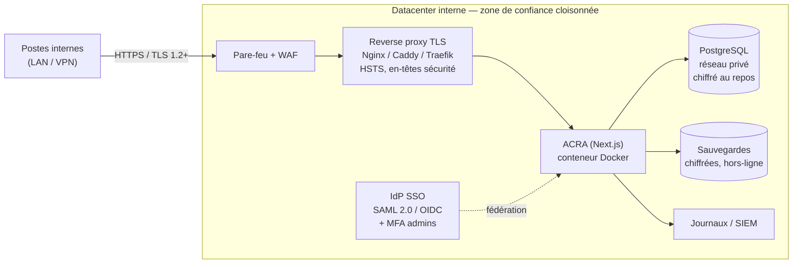
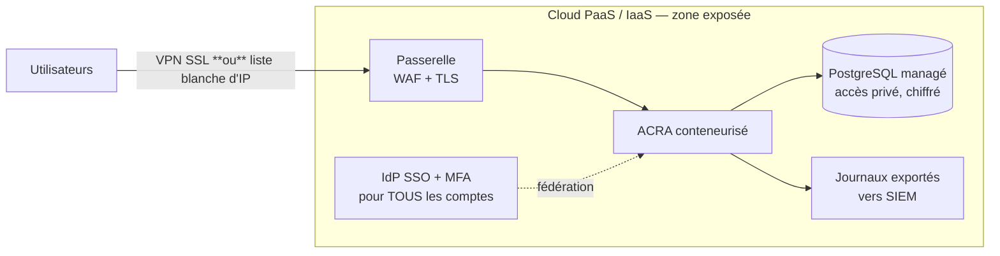

<div align="center">


# ACRA — Augmented Cyber Risk Analysis

**La plateforme open-source qui rend l'analyse de risques EBIOS RM accessible à tous**

[](https://nextjs.org/)
[](https://www.typescriptlang.org/)
[](https://www.prisma.io/)
[](https://www.postgresql.org/)
[](https://www.docker.com/)
[](./LICENSE)
[](https://www.ssi.gouv.fr/guide/ebios-risk-manager-la-methode/)
[](https://www.iso.org/standard/75281.html)

**🌐 Langue / Language :** 🇫🇷 Français · [🇬🇧 English](README.en.md) · [🇩🇪 Deutsch](README.de.md) · [🇪🇸 Español](README.es.md) · [🇮🇹 Italiano](README.it.md)

</div>

---

## 🎯 Présentation

**ACRA (Augmented Cyber Risk Analysis)** est une application web guidée qui permet à n'importe quelle équipe sécurité — même sans expertise pointue — de conduire une analyse de risques complète selon la méthode **EBIOS Risk Manager** de l'ANSSI, compatible **ISO 27005**.

### Le problème qu'ACRA résout

Les analyses de risques EBIOS RM sont exigeantes : la méthode comporte 5 ateliers interconnectés, des dizaines de concepts à maîtriser, et la moindre erreur de cohérence peut invalider toute la démarche. En pratique, les équipes s'appuient sur des tableurs Excel complexes, des consultants coûteux, ou renoncent à la rigueur méthodologique.

ACRA change ça : c'est un **assistant méthodologique interactif** qui guide pas à pas, propose des exemples cliquables à chaque étape, maintient la cohérence entre les ateliers, et produit automatiquement un rapport PDF structuré.

### Pour qui ?

| Profil | Usage |
|--------|-------|
| 🔒 RSSI & Risk Managers | Piloter les analyses, approuver, superviser le portefeuille de risques |
| 🔍 Analystes sécurité | Conduire les ateliers, documenter les scénarios, planifier les mesures |
| 🏢 DSI & Directions | Lire les synthèses, suivre le traitement, valider les budgets mesures |
| 🎓 Étudiants & formateurs | Apprendre la méthode EBIOS RM sur un outil concret |

### Ce qui différencie ACRA

- **Guidage méthodologique intégré** : chaque champ dispose d'un tooltip, d'un lien vers le guide ANSSI, et d'exemples contextuels
- **Cohérence automatique** : les éléments d'un atelier alimentent automatiquement les ateliers suivants
- **7 référentiels de mesures** : ISO 27001:2022, NIST CSF, NIST 800-53, CIS Controls v8, ANSSI Hygiène, HDS, PCI-DSS — depuis une seule interface
- **Mode Express** : une analyse complète (A1+A2+A5) en moins de 30 minutes pour les contextes urgents
- **100% auto-hébergé** : vos données ne quittent jamais votre infrastructure

---

## ✨ Fonctionnalités

### 📋 Méthode EBIOS RM complète

- **5 ateliers guidés** avec bibliothèque d'exemples cliquables (valeurs métier, sources de risque, scénarios, mesures…)
- **Mode Analyse express** (A1 + A2 + A5) pour obtenir rapidement une liste de risques et un plan d'action
- **Guide EBIOS RM interactif** intégré avec liens directs vers les pages du guide officiel ANSSI
- **Matrice des risques** visuelle (gravité × vraisemblance) avec niveaux résiduels et comparaison avant/après mesures
- Critères **DICT** (Disponibilité, Intégrité, Confidentialité, Traçabilité) sur valeurs métier et biens supports
- Liens MITRE ATT&CK sur les scénarios opérationnels
- **Cartographie de menace de l'écosystème** (Atelier 3, fiche méthode 5 ANSSI) : dangerosité des parties prenantes calculée sur 4 sous-critères, radar polaire à 3 zones, échelles configurables, marquage des tiers critiques — [voir le détail](#️-cartographie-de-menace-de-lécosystème-atelier-3)
- **Vue Tiers** transverse : gestion des parties prenantes (*third-party management*) agrégée sur toutes les analyses, filtrable par zone et criticité

### 🔐 Sécurité & référentiels

- Mesures de sécurité issues de **7 référentiels** : ISO 27001:2022 · NIST CSF · NIST 800-53 · CIS Controls v8 · ANSSI Hygiène · HDS · PCI-DSS + contrôles personnalisés
- Politique de mot de passe configurable (longueur, complexité, expiration, historique, verrouillage)
- **MFA** configurable (OTP à usage unique par **e-mail** ou **SMS**) avec fenêtre de confirmation de 60 min pour éviter tout verrouillage accidentel
- **SSO** configurable (SAML 2.0 ou OIDC) — provisioning automatique des comptes
- Piste d'audit complète exportable (CSV)

### 👥 Collaboration & gouvernance

- **RBAC 5 niveaux** : ADMIN · RSSI · RISK_MANAGER · ANALYSTE · LECTEUR
- Workflow d'approbation : soumission → révision → approbation (RSSI ou Risk Manager)
- Partage d'accès par analyse avec permissions individuelles
- Dashboard admin : gestion des utilisateurs, création de comptes, suspension, logs d'audit
- **Récupération (corbeille)** : une analyse supprimée par un utilisateur reste restaurable par un administrateur pendant **30 jours** avant purge définitive

### 📊 Export & reporting

- Export **PDF** structuré multi-pages (synthèse executive, KPIs, ateliers, mesures, annexes méthodologiques)
- Export **Excel (.xlsx)** avec toutes les données tabulaires par onglet
- Export **JSON** (sauvegarde complète, réimportable) et **CSV** (données tabulaires)
- Import d'analyse depuis JSON ou CSV

### 🌐 UX & accessibilité

- Interface en **5 langues** : Français · English · Deutsch · Español · Italiano
- **Auto-save** à chaque modification (aucune perte de données)
- Tableau de bord avec KPIs, graphiques, alertes risques critiques, recherche globale
- Thème clair / sombre / automatique
- Conforme RGAA : navigation clavier, ARIA, contrastes accessibles

---

## 🎬 Démo


## 📸 Aperçu de l'interface

| | Thème clair | Thème sombre |
|---|---|---|
| **Tableau de bord** |  |  |
| **Mes analyses** |  |  |
| **Atelier 1 — Cadrage & socle** |  |  |
| **Atelier 5 — Traitement du risque** |  |  |
| **Cartographie des risques** |  |  |
| **Configuration (échelles & matrice)** |  |  |
| **Administration** |  |  |
| **Journal d'audit** |  |  |

> 🆕 Voir aussi la **[cartographie de menace de l'écosystème](#️-cartographie-de-menace-de-lécosystème-atelier-3)** (radar de dangerosité des tiers) et le module **[Récupération](docs/screenshots/admin-recovery-light.png)** (corbeille 30 jours).

<details>
<summary>📐 Galerie côte à côte en grand format</summary>

### Tableau de bord
 

### Atelier 1 — Cadrage & socle de sécurité
 

### Atelier 5 — Traitement du risque
 

### Cartographie des risques
 

### Configuration — échelles & matrice
 

</details>

---

## 🚀 Quick Start (Docker)

**Aucune installation locale de Node, npm ou Prisma n'est requise** : l'image Docker
embarque toutes les dépendances et le client Prisma, et applique les migrations
automatiquement au démarrage (service `migrator`).

```bash
git clone https://github.com/votre-org/acra.git
cd acra
make setup        # génère .env + secrets aléatoires (interactif)
docker compose up -d
```

> Pas de `make` ? Utilisez directement : `./scripts/setup.sh` (ou `npm run setup`).
> Installation automatisée / CI (aucune question posée) : `./scripts/setup.sh --auto`.

`setup.sh` génère pour vous des secrets forts (`NEXTAUTH_SECRET`, mot de passe
PostgreSQL, `SECRETS_ENCRYPTION_KEY`) et **ne régénère que les valeurs manquantes**
s'il est relancé (détails en section « Installation détaillée » ci-dessous).

**L'application est disponible sur http://localhost:3000.**
Créez votre compte sur `/auth/register` — **le premier compte créé devient
automatiquement ADMINISTRATEUR**.

Pour charger les données de démonstration (optionnel, jamais en production) :

```bash
docker compose exec app npx prisma db seed
# Compte démo créé : admin@chu-metropole.fr / Acra@Admin2024!
# ⚠️ Tests uniquement — changez/supprimez ce compte avant toute mise en production
```

---

## 📦 Installation détaillée

### Prérequis

| Outil | Version minimale | Notes |
|-------|-----------------|-------|
| Docker Desktop | 4.x | ou Docker Engine + Compose v2 |
| RAM disponible | 512 Mo | 1 Go recommandé |
| Ports libres | 3000, 5432 | configurables dans `docker-compose.yml` |

> **Sans Docker** (développement local) : Node.js 20+ et PostgreSQL 14+ requis — voir [Développement local](#-développement-local).

---

### Étape 1 — Cloner le dépôt

```bash
git clone https://github.com/votre-org/acra.git
cd acra
```

---

### Étape 2 — Configurer l'environnement (automatisé)

Le script de setup crée le fichier `.env` et **génère des secrets forts**. Il est
**idempotent** : relancé, il conserve les valeurs déjà définies et ne complète que
ce qui manque.

```bash
./scripts/setup.sh          # interactif (demande l'URL publique et la clé IA)
# ou, sans aucune interaction (secrets aléatoires, URL par défaut) :
./scripts/setup.sh --auto
```

Le script renseigne automatiquement :

| Variable | Rôle | Généré par setup.sh |
|----------|------|:---:|
| `NEXTAUTH_SECRET` | Signature des sessions JWT | ✅ aléatoire (48 o) |
| `POSTGRES_PASSWORD` | Mot de passe PostgreSQL | ✅ aléatoire (32 car.) |
| `SECRETS_ENCRYPTION_KEY` | Chiffrement AES-256-GCM des secrets en base (OIDC, SMS, SMTP) | ✅ aléatoire (48 o) |
| `DATABASE_URL` | Connexion Prisma | ✅ dérivée des variables PostgreSQL |
| `POSTGRES_USER` / `POSTGRES_DB` | Identité de la base | `acra_user` / `acra_rm` |
| `NEXTAUTH_URL` | URL publique | demandée (défaut `http://localhost:3000`) |
| `ANTHROPIC_API_KEY` | Clé IA (optionnelle) | jamais générée — laissée vide si absente |

> **Configuration manuelle** (alternative) : `cp .env.example .env` puis remplacez
> toutes les valeurs `CHANGEZ_MOI`. Générez un secret avec `openssl rand -base64 48`.
>
> ⚠️ **Production** : `NEXTAUTH_URL` doit être en **HTTPS**. Ne committez jamais `.env`
> (déjà dans `.gitignore`). Si `SECRETS_ENCRYPTION_KEY` change, les secrets déjà
> chiffrés en base devront être ressaisis dans l'interface d'administration.

---

### Étape 3 — Démarrer les services

```bash
docker compose up -d
```

Docker lance 3 services :
- **`db`** — PostgreSQL 16 (port 5432)
- **`migrator`** — exécute `prisma migrate deploy` au démarrage (s'arrête ensuite)
- **`app`** — Application Next.js (port 3000)

Vérifier que tout est opérationnel :

```bash
docker compose ps
# Tous les services doivent être en status "running" (sauf migrator : "exited 0")

curl http://localhost:3000/api/health
# {"status":"ok","db":"connected","timestamp":"..."}
```

---

### Commandes utiles

```bash
# Voir les logs en temps réel
docker compose logs -f app

# Arrêter les services
docker compose down

# Arrêter ET supprimer les volumes (efface la base de données)
docker compose down -v

# Rebuild après modification du code
docker compose up -d --build

# Accéder à la base de données via psql (utilise les identifiants du conteneur)
docker compose exec db sh -c 'psql -U "$POSTGRES_USER" "$POSTGRES_DB"'

# Exécuter un seed de données de démonstration
docker compose exec app npx prisma db seed

# Lancer les migrations manuellement
docker compose exec app npx prisma migrate deploy
```

---

### Mise à jour

```bash
git pull origin main
docker compose up -d --build
# Les migrations sont appliquées automatiquement au démarrage
```

---

### Sauvegarde et restauration

Les sauvegardes PostgreSQL sont automatisées dans `docker-compose.yml` (rotation 7 jours) :

```bash
# Sauvegarde manuelle
docker compose exec db sh -c 'pg_dump -U "$POSTGRES_USER" "$POSTGRES_DB"' > backup_$(date +%Y%m%d).sql

# Restauration
docker compose exec -T db sh -c 'psql -U "$POSTGRES_USER" "$POSTGRES_DB"' < backup_20240115.sql
```

---

## 🔧 Développement local

Pour contribuer ou personnaliser ACRA sans Docker :

### Prérequis

- **Node.js** 20+ (`node --version`)
- **PostgreSQL** 14+ (ou Docker pour la DB uniquement)
- **npm** 10+

### Installation

```bash
# 1. Cloner le dépôt
git clone https://github.com/votre-org/acra.git
cd acra

# 2. Installer les dépendances (génère aussi le client Prisma via postinstall)
npm install

# 3. Démarrer PostgreSQL via Docker (option la plus simple)
docker run -d --name acra-db \
  -e POSTGRES_USER=acra_user \
  -e POSTGRES_PASSWORD=acra_secret \
  -e POSTGRES_DB=acra_rm \
  -p 5432:5432 postgres:16-alpine

# 4. Configurer l'environnement (génère .env avec des secrets)
./scripts/setup.sh --auto
# En local sans Docker pour l'app, pointez la base sur localhost :
sed -i 's/@db:5432/@localhost:5432/' .env

# 5. Appliquer les migrations et générer le client Prisma
npx prisma migrate deploy
npx prisma generate

# 6. (Optionnel) Charger les données de démonstration
npx prisma db seed

# 7. Démarrer en mode développement (hot reload)
npm run dev
```

L'application est disponible sur **http://localhost:3000**

### Scripts disponibles

```bash
npm run dev          # Serveur de développement (hot reload)
npm run build        # Build de production
npm run start        # Serveur de production (après build)
npm run setup        # (Ré)génère le fichier .env (secrets manquants)
npm test             # Tests unitaires Vitest (run once)
npm run test:watch   # Tests en mode watch
npm run test:coverage # Rapport de couverture
npx tsc --noEmit     # Vérification TypeScript sans compilation
```

### Workflow TDD

> **TDD obligatoire** : chaque nouvelle fonctionnalité doit être accompagnée d'un test écrit *avant* l'implémentation. Voir [CONTRIBUTING.md](./CONTRIBUTING.md).

```bash
# 1. Écrire le test (il doit échouer)
# → src/__tests__/unit/lib/ma-feature.test.ts

# 2. Lancer en watch pour voir le rouge
npm run test:watch

# 3. Implémenter jusqu'au vert
# 4. Refactorer
```

---

## 🏗️ Architecture

```
ebios-rm/
├── src/
│   ├── app/                          # Pages Next.js (App Router)
│   │   ├── page.tsx                  # Landing page
│   │   ├── dashboard/                # Tableau de bord KPIs
│   │   ├── analyses/                 # Liste, création, détail
│   │   │   └── [id]/atelier/[num]/  # Les 5 ateliers EBIOS RM
│   │   ├── risques/                  # Vue globale des risques
│   │   ├── tiers/                     # Vue transverse des parties prenantes
│   │   ├── actions/                  # Plan d'action global (filtres)
│   │   ├── auth/                     # Login / Register / Reset
│   │   ├── admin/                    # Administration (ADMIN uniquement)
│   │   │   ├── users/                # Gestion des utilisateurs
│   │   │   ├── security/             # Politique MFA, SSO, mot de passe
│   │   │   ├── smtp/                 # Configuration SMTP
│   │   │   ├── audit/                # Journal d'audit
│   │   │   └── recovery/             # Récupération des analyses (corbeille 30 j)
│   │   ├── configuration/            # Échelles, matrice, référentiels, écosystème
│   │   └── profile/                  # Profil, langue, thème
│   │   └── api/                      # Routes API REST (Next.js)
│   ├── components/
│   │   ├── workshops/                # Atelier1.tsx → Atelier5.tsx
│   │   ├── Navbar.tsx                # Navigation principale + recherche
│   │   ├── RiskMatrix.tsx            # Matrice des risques interactive
│   │   ├── EcosystemRadar.tsx        # Radar de menace de l'écosystème (Atelier 3)
│   │   ├── MenaceFormulaDiagram.tsx  # Schéma HTML du calcul de la menace
│   │   ├── WorkshopProgress.tsx      # Barre de progression ateliers
│   │   ├── EbiosGuide.tsx            # Guide interactif EBIOS RM
│   │   ├── FrameworkControlsPanel.tsx # Panel mesures multi-référentiel
│   │   └── AnalysesChart.tsx         # Graphiques dashboard
│   └── lib/
│       ├── ebios-data.ts             # Bibliothèque EBIOS RM (suggestions)
│       ├── frameworks-data.ts        # Contrôles ISO 27001, NIST, CIS…
│       ├── ecosystem-radar.ts        # Géométrie + zones du radar (testé)
│       ├── ecosystem-echelles.ts     # Échelles configurables de dangerosité
│       ├── recovery.ts               # Rétention 30 j de la corbeille (testé)
│       ├── permissions.ts            # Matrice RBAC centralisée
│       ├── logger.ts                 # Logs structurés Winston + audit trail
│       ├── useAutoSave.ts            # Hook React auto-save
│       ├── password-policy.ts        # Validation politique mot de passe
│       ├── prisma.ts                 # Client Prisma singleton
│       └── i18n/                     # Traductions (fr/en/de/es/it)
├── prisma/
│   ├── schema.prisma                 # Modèle de données PostgreSQL
│   └── migrations/                   # Migrations SQL versionnées
├── src/__tests__/                    # Tests unitaires Vitest
├── docker-compose.yml
├── Dockerfile
└── .env.example
```

### Stack technique

| Couche | Technologie | Version |
|--------|-------------|---------|
| Framework | Next.js App Router (Server + Client Components) | 16 |
| Langage | TypeScript strict | 5 |
| Base de données | PostgreSQL | 16 |
| ORM | Prisma | 5 |
| Authentification | NextAuth.js (credentials + JWT) | 4 |
| UI | Tailwind CSS | 3 |
| Export PDF | @react-pdf/renderer (server-side) | — |
| Export Excel | ExcelJS | — |
| Tests | Vitest + Testing Library | — |
| Logs | Winston (JSON structuré) | — |
| IA (optionnel) | Claude API (Anthropic) | — |
| Déploiement | Docker + Docker Compose | — |

---

## 🔒 Sécurité

### Mesures en place

- Mots de passe hashés **bcrypt** (coût 12)
- Sessions **JWT** signées (`NEXTAUTH_SECRET`)
- Middleware d'authentification Next.js sur toutes les routes protégées
- **Headers HTTP sécurité** : X-Frame-Options, CSP, X-Content-Type-Options, Referrer-Policy, HSTS
- Validation des entrées côté serveur : schémas **Zod** (authentification, politiques admin) et **sanitizers par allowlist** sur les ateliers et imports (anti mass-assignment, CWE-915)
- Isolation des données par utilisateur + RBAC par analyse + **suppression douce** (corbeille 30 j) au lieu d'un effacement immédiat
- **Piste d'audit complète** (table `AuditLog`) pour toutes les actions sensibles, exportable CSV
- Rate limiting sur les routes d'authentification
- **MFA** configurable avec fenêtre de sécurité (auto-désactivation si non confirmé sous 60 min)
- **SSO** SAML 2.0 / OIDC configurable

### Checklist production

```bash
# 1. Générer tous les secrets (NEXTAUTH_SECRET, mot de passe PostgreSQL,
#    SECRETS_ENCRYPTION_KEY) en une commande — idempotent :
./scripts/setup.sh --auto

# 2. Définir l'URL publique HTTPS dans .env
#    NEXTAUTH_URL=https://acra.mondomaine.fr   (HTTPS obligatoire)

# 3. Placer derrière un reverse proxy HTTPS (Nginx, Caddy, Traefik + TLS)

# 4. Ne PAS charger le seed de démo en production. S'il l'a été par erreur :
#    connectez-vous sur /admin/users et supprimez/réinitialisez admin@chu-metropole.fr

# 5. Démarrer et vérifier le health check
docker compose up -d
curl https://votre-domaine.com/api/health
# {"status":"ok","db":"connected",...}
```

> Le **premier compte** créé sur `/auth/register` devient **ADMINISTRATEUR**.
> Créez-le immédiatement après le déploiement pour éviter qu'un tiers ne s'attribue
> ce rôle (l'inscription est ouverte par défaut).

> Un audit de sécurité OWASP/WSTG complet a été conduit sur l'application. Voir le rapport dans [docs/](./docs/).

---

## 🏛️ Architecture sécurisée recommandée (bonnes pratiques ANSSI)

ACRA traite des données sensibles (analyses de risques, cartographie de l'écosystème). Le déploiement doit suivre les principes du **guide d'hygiène informatique de l'ANSSI** : cloisonnement, défense en profondeur, moindre privilège, authentification forte, journalisation.

### Cas 1 — Hébergement interne *on-premises* (recommandé)

Hébergement **dans votre datacenter**, derrière un pare-feu, sans exposition directe sur Internet. C'est le scénario à privilégier pour les données les plus sensibles.



**Mesures clés :**
- Réseau **cloisonné** (VLAN dédié), application **non exposée** sur Internet ; accès via LAN ou **VPN**.
- **Pare-feu** + WAF en amont ; reverse proxy **TLS 1.2+** terminant le HTTPS (`NEXTAUTH_URL=https://…`), **HSTS** activé.
- **SSO** (SAML/OIDC) + **MFA obligatoire pour les administrateurs** (OTP e-mail/SMS).
- PostgreSQL **jamais exposé** publiquement, **chiffré au repos**, accès restreint à l'app.
- **Sauvegardes chiffrées** régulières et testées (cf. section Sauvegarde) ; secrets via coffre (`SECRETS_ENCRYPTION_KEY`).
- **Journalisation** centralisée (piste d'audit ACRA + logs Winston → SIEM) ; revue d'accès périodique.

### Cas 2 — Hébergement externe *PaaS / IaaS* (cloud)

Si l'hébergement se fait sur un cloud externe (IaaS/PaaS), **réduisez la surface d'exposition** et renforcez l'authentification pour **tous** les comptes.



**Mesures clés (en plus du cas 1) :**
- Accès restreint par **liste blanche d'adresses IP** **ou** **VPN SSL** — pas d'accès public ouvert.
- **SSO + MFA pour TOUS les utilisateurs** (pas seulement les admins).
- Base de données **managée en réseau privé** (jamais d'IP publique), chiffrement en transit et au repos.
- Secrets dans un **coffre managé** (KMS / Secrets Manager) ; rotation régulière.
- Journaux exportés vers un **SIEM** ; alerting sur les événements sensibles (connexions, exports, suppressions).

### Ce qu'ACRA fournit pour appliquer ces bonnes pratiques

| Bonne pratique ANSSI | Fonctionnalité ACRA |
|---|---|
| Authentification forte | **MFA** OTP e-mail/SMS, périmètre `ALL` ou `ADMIN_ONLY` |
| Identité fédérée | **SSO** SAML 2.0 / OIDC avec provisioning auto |
| Moindre privilège | **RBAC** 5 rôles + partage par analyse |
| Traçabilité | **Piste d'audit** complète, exportable CSV |
| Confidentialité en transit | HTTPS imposé + **en-têtes de sécurité** (CSP, HSTS, X-Frame-Options…) |
| Protection des secrets | Secrets chiffrés (`SECRETS_ENCRYPTION_KEY`), bcrypt (coût 12) |
| Réversibilité / anti-erreur | **Corbeille 30 jours** (suppression douce + récupération admin) |
| Robustesse des entrées | Zod + **sanitizers par allowlist** (anti mass-assignment) |

---

## 📖 Les 5 ateliers EBIOS RM

| # | Atelier | Description |
|---|---------|-------------|
| **A1** | Cadrage et socle de sécurité | Périmètre, missions, valeurs métier (critères DICT), biens supports, événements redoutés, référentiels de sécurité |
| **A2** | Sources de risque | Identification des attaquants, objectifs visés (couples SR/OV), niveaux de pertinence P1/P2 |
| **A3** | Scénarios stratégiques | Écosystème, **cartographie de menace des parties prenantes** (radar de dangerosité), chemins d'attaque, mesures de sécurité de l'écosystème |
| **A4** | Scénarios opérationnels | Actions techniques des attaquants, vraisemblance, liens MITRE ATT&CK |
| **A5** | Traitement du risque | Stratégies de traitement (réduction, transfert, refus, acceptation), mesures par référentiel, risques résiduels, plan d'action |

> **🚀 Mode Express** : parcours rapide A1 → A2 → A5 disponible depuis le dashboard pour obtenir une liste de risques et un plan d'action en moins de 30 minutes. Idéal pour les contextes urgents ou les premières analyses.

---

## 🗺️ Cartographie de menace de l'écosystème (Atelier 3)

ACRA implémente la **fiche méthode 5 de l'ANSSI / Club EBIOS** (« construire l'estimation de la dangerosité des parties prenantes ») pour prioriser les tiers de l'écosystème : fournisseurs, prestataires, clients, partenaires, régulateurs.

Le niveau de menace d'un tiers se calcule à partir de **4 sous-critères** cotés sur des échelles qualitatives :

```text
                Dépendance × Pénétration            (exposition, ↑ menace)
menace  =  ───────────────────────────────────
                Maturité cyber × Confiance           (fiabilité, ↓ menace)
```

Les tiers sont positionnés sur un **radar polaire** : plus un point est proche du centre, plus la menace est élevée. Trois zones d'**égale largeur** — danger / contrôle / veille — guident la priorisation (les tiers en danger ou contrôle sont *critiques* et entrent dans les scénarios stratégiques).

| Radar de menace | Schéma de calcul (aide intégrée) |
|---|---|
|  |  |

**Lecture du radar :**

- **Couleur** du point = fiabilité cyber (rouge faible → vert forte)
- **Taille** du point = exposition (plus gros = plus exposé)
- **Anneaux** = zones de menace (danger orange · contrôle jaune · veille vert)
- **★** = tiers marqué *critique* (manuel)
- **Libellé** = nom court éditable (clic direct sur le libellé du point) ou réf `T1, T2…`
- Survol d'un point → détail des 4 sous-critères, exposition/fiabilité et menace

**Échelles configurables** — chaque niveau des 4 critères (1→4 par défaut) est renommable dans `Configuration → Écosystème`, avec ajout/suppression de niveaux (réservé ADMIN). Le calcul du radar s'adapte automatiquement à l'échelle.


**Vue Tiers transverse** — la page **Tiers** agrège les parties prenantes de **toutes** les analyses, filtrables par zone et par criticité (★), pour une gestion des tiers (*third-party management*) à l'échelle de l'organisation. Un même tiers peut y apparaître plusieurs fois (sa dangerosité dépend du périmètre analysé).


Le radar, les étoiles de criticité et le tableau des parties prenantes (4 sous-critères + colonne *Critique*) sont également présents dans l'**export PDF**.

---

## 🌐 Internationalisation

L'interface est disponible en **5 langues**, sélectionnable à tout moment dans le profil :

| Code | Langue | Complétude |
|------|--------|-----------|
| `fr` | Français | ✅ 100% (référence) |
| `en` | English | ✅ 100% |
| `de` | Deutsch | ✅ 100% |
| `es` | Español | ✅ 100% |
| `it` | Italiano | ✅ 100% |

Pour ajouter une langue, copier `src/lib/i18n/fr.ts`, traduire toutes les clés et enregistrer le fichier avec le code ISO 639-1 correspondant. TypeScript vérifiera automatiquement que toutes les clés sont présentes.

---

## 👥 Rôles utilisateurs (RBAC)

| Rôle | Créer analyse | Modifier | Approuver | Admin |
|------|:---:|:---:|:---:|:---:|
| `ADMIN` | ✅ | ✅ toutes | ✅ | ✅ |
| `RSSI` | ✅ | ✅ siennes + partagées | ✅ | ❌ |
| `RISK_MANAGER` | ✅ | ✅ siennes + partagées | ✅ | ❌ |
| `ANALYSTE` | ✅ | ✅ siennes + partagées | ❌ | ❌ |
| `LECTEUR` | ❌ | ❌ | ❌ | ❌ |

Les accès peuvent également être accordés **analyse par analyse** (partage ponctuel avec n'importe quel utilisateur).

---

## 🛠️ Dépannage

### L'application ne démarre pas

```bash
# Vérifier l'état des conteneurs
docker compose ps

# Voir les logs détaillés
docker compose logs app
docker compose logs migrator

# Vérifier que les ports sont libres
lsof -i :3000
lsof -i :5432
```

### Erreur de migration Prisma

```bash
# Forcer la régénération des migrations
docker compose exec app npx prisma migrate resolve --applied "nom_migration"
docker compose exec app npx prisma migrate deploy
```

### Problème de connexion à la base de données

```bash
# Vérifier la connectivité
docker compose exec app npx prisma db execute --stdin <<< "SELECT 1;"

# Vérifier la variable DATABASE_URL dans .env
docker compose exec app env | grep DATABASE
```

### Réinitialiser complètement l'application

```bash
# ⚠️ Efface toutes les données
docker compose down -v
docker compose up -d
```

---

## 🤝 Contributing

Voir [CONTRIBUTING.md](./CONTRIBUTING.md) pour le guide complet.

**TL;DR :**
1. Forker le dépôt et créer une branche `feature/ma-feature`
2. Écrire les tests d'abord (**TDD obligatoire** — voir CLAUDE.md)
3. Implémenter et vérifier que `npm test` passe en vert
4. Ajouter les traductions dans les **5 fichiers i18n** si des chaînes UI sont ajoutées
5. Lancer `npx tsc --noEmit` — zéro erreur TypeScript
6. Ouvrir une Pull Request avec une description claire

---

## 📄 Licence

MIT — voir [LICENSE](./LICENSE)

La méthode EBIOS RM est développée et maintenue par l'[ANSSI](https://www.ssi.gouv.fr/guide/ebios-risk-manager-la-methode/). Cette application n'est pas affiliée à l'ANSSI.
